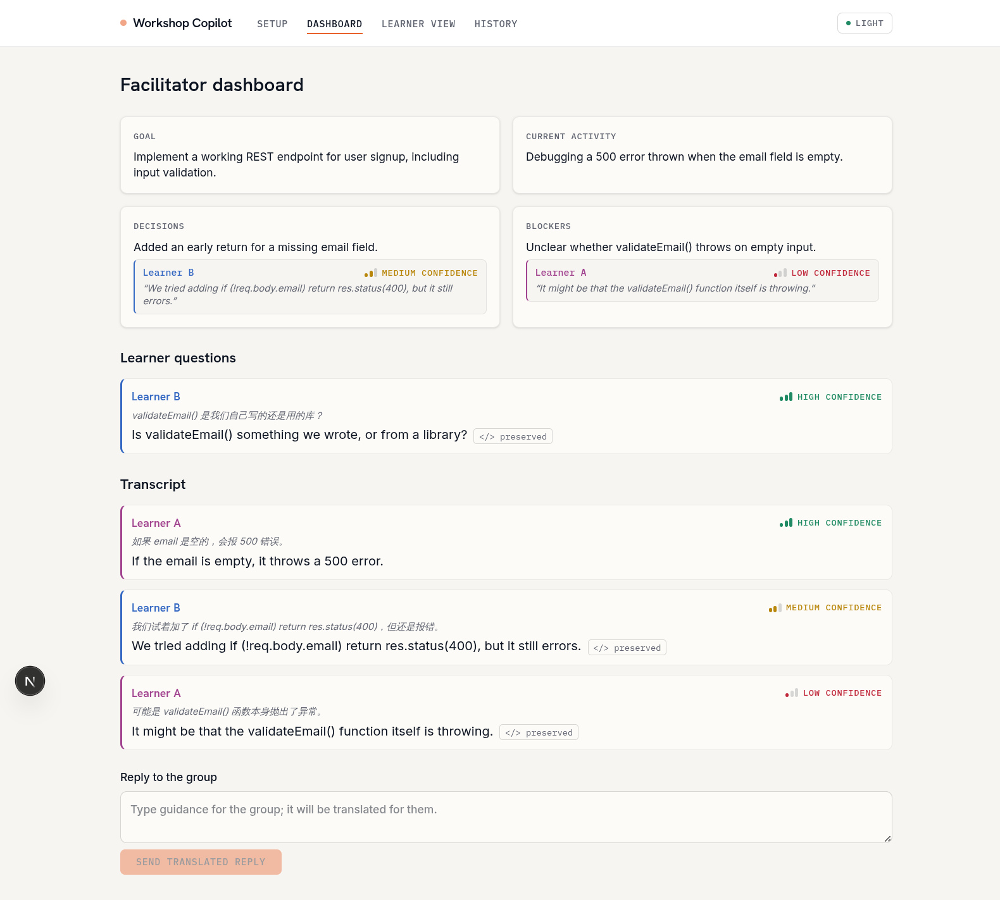
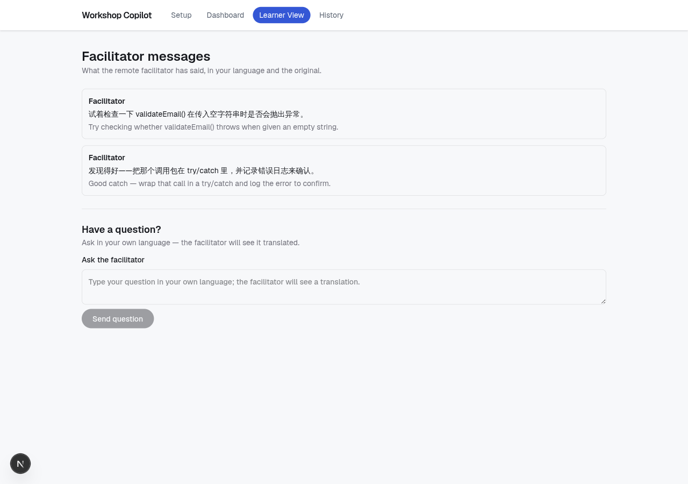

# Cross-Lingual Remote Workshop Facilitation

A prototype built for the **"Breaking Language Barriers"** hackathon challenge: help learners and facilitators communicate more clearly across language differences during real-time online/hybrid learning sessions — live speech-to-text, translation, and AI-generated context (progress, decisions, blockers) grounded in the actual discussion.

Our demo scenario: a remote facilitator supporting a hands-on workshop run in a language they don't speak.

See [`docs/problem_statement.md`](docs/problem_statement.md) for the official challenge statement, our interpretation, target users, and success criteria, and [`docs/approaches.md`](docs/approaches.md) for market validation, the shared pipeline design, and the five candidate approaches under consideration.

## Tech Stack

- **Frontend:** Next.js (App Router) + TypeScript + Tailwind CSS
- **Speech-to-text:** Deepgram Nova-3 (multi-speaker diarization)
- **Translation:** DeepL API
- **Understanding/summarization:** Claude API, with prompt caching over the growing transcript
- **Real-time transport:** WebSockets
- **Hosting:** Vercel

## Getting Started

Install dependencies and run the dev server:

```bash
npm install
npm run dev
```

Open [http://localhost:3000](http://localhost:3000) to view the app. Edit `src/app/page.tsx` to get started — the page auto-updates as you edit.

## Screenshots

**Facilitator dashboard** — goal, current activity, decisions, and blockers extracted from the live transcript, plus learner questions and a reply box that auto-translates.


**Facilitator dashboard (light mode)**



**Learner view** — facilitator messages translated into the learner's language, with the original preserved.


**Learner question box** — learners can ask questions in their own language; the facilitator sees a translation.



**Dashboard with learner questions**


**Session setup**


**Session history**


**Live caption ticker — facilitator dashboard**


**Live caption ticker — learner view**


## Project Structure

```
docs/                  Problem statement and brainstorm/validation docs
src/app/                Next.js App Router pages and layouts
```

## Learn More

- [Next.js Documentation](https://nextjs.org/docs)
- [Deepgram Docs](https://developers.deepgram.com/)
- [DeepL API Docs](https://developers.deepl.com/)
