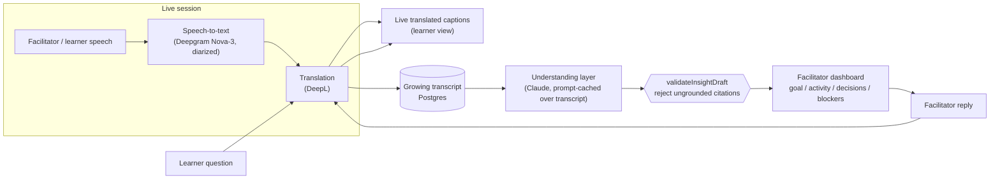

# 5-Minute Pitch Video — Recording Guide

A script and shot list for the "Breaking Language Barriers" hackathon pitch,
built around the demo scenario this repo already implements: a remote
facilitator supporting a hands-on coding workshop run in a language they
don't speak. Pair this with the screenshots in `docs/screenshots/` — every
beat below names the exact file to have on screen.

## Before you hit record

1. `npm run db:seed` — loads the "Debugging a signup 500 error" fixture
   (English facilitator, Chinese + Spanish learners) with a ready learner
   join link. This is the same fixture behind the screenshots in this repo.
2. `npm run dev`, open the facilitator dashboard in one window/tab and the
   learner view (via the seeded join link, or the QR code on `/setup`) in
   another — see `docs/screenshots/phase0-facilitator-qr.png`.
3. Have `docs/screenshots/setup.png` ready in case you want to show session
   creation instead of narrating it.

## Timing (5:00 total)

| Time | Section | Say / show |
| --- | --- | --- |
| 0:00–0:40 | Problem | State the problem in one sentence: facilitators and learners lose each other across a language gap in live sessions — someone falls behind, and nobody notices until it's too late. Reference `docs/problem_statement.md`'s challenge statement directly. |
| 0:40–1:15 | Approach | One diagram, one sentence: "we turn live speech into translated captions, then have an AI layer read the transcript for goal/decisions/blockers instead of leaving that to a human." Show the architecture diagram below. |
| 1:15–3:15 | Live demo | The core two minutes — see script below. |
| 3:15–4:15 | Why this is hard / what's real | Diarized STT → translation → evidence-grounded AI summary is a three-stage pipeline where each stage can drop accuracy; call out `validateInsightDraft` (`src/lib/providers/insight.ts`) rejecting any AI insight that cites a transcript segment outside its source batch — the guardrail against hallucinated "decisions." |
| 4:15–4:50 | Impact & feasibility | Tie back to judging criteria: impact (nobody is left behind silently), prototype quality (real Postgres-backed sessions, not slideware), feasibility (Deepgram + DeepL + Claude are shipping APIs, not research). |
| 4:50–5:00 | Close | One-line ask / next step. |

## Live demo script (1:15–3:15)

Follow the facilitator → learner → facilitator loop so the video shows a
real round-trip, not just two static screens.

1. **Facilitator dashboard** (`docs/screenshots/dashboard.png`) — point at
   the goal card, then the live-updating decisions/blockers cards, and note
   they're each linked to the transcript line that produced them (evidence
   grounding, not a generic summary).
2. **Learner joins mid-session** (`docs/screenshots/phase0-facilitator-qr.png`
   → `docs/screenshots/learner.png`) — scan/open the join link, show captions
   arriving translated into the learner's language with the original
   preserved underneath.
3. **Learner asks a question in their own language**
   (`docs/screenshots/dashboard-learner-questions.png`) — show it arriving
   translated on the facilitator side, and the facilitator replying through
   the auto-translating reply box.
4. **Quiet-learner nudge** (`docs/screenshots/dashboard-quiet-escalation.png`,
   `docs/screenshots/learner-quiet-nudge.png`) — the system notices a learner
   has gone quiet and prompts a check-in; this is the "facilitators can't
   tell who's lost" problem from the challenge statement, solved directly.
5. **Glossary protecting code terms**
   (`docs/screenshots/ai-glossary-before.png` →
   `docs/screenshots/ai-glossary-after.png`) — a one-shot visual proof that
   translation doesn't mangle `validateEmail()` or `req.body.email`.
6. **Catch-up history** (`docs/screenshots/history.png`) — a learner who
   joined late gets a grounded summary instead of scrolling a raw transcript.

Cut anything you're short on time for in this order (least to most
essential): glossary demo, quiet nudge, history — keep goal/decisions/
blockers and the live translated Q&A round-trip no matter what, since that's
the challenge statement's suggested demo almost verbatim.

## Architecture (for the 0:40–1:15 beat)

## Judging-criteria cheat sheet

Keep these three phrases ready to say out loud — they map directly onto
`docs/problem_statement.md`'s judging criteria so nothing you build reads as
generic:

- **Impact** — "a learner going quiet in a language the facilitator doesn't
  speak used to be invisible; now it's a card on the dashboard."
- **Prototype quality** — "this is a real Postgres-backed session with
  role-scoped join links, not a slide" — point at `npm run db:seed` and the
  opaque learner join token (`src/lib/session-security.ts`).
- **Innovation & feasibility** — "translation-only tools stop at the words;
  we ground an AI summary in the transcript with a citation guardrail so it
  can't invent a decision nobody made."
