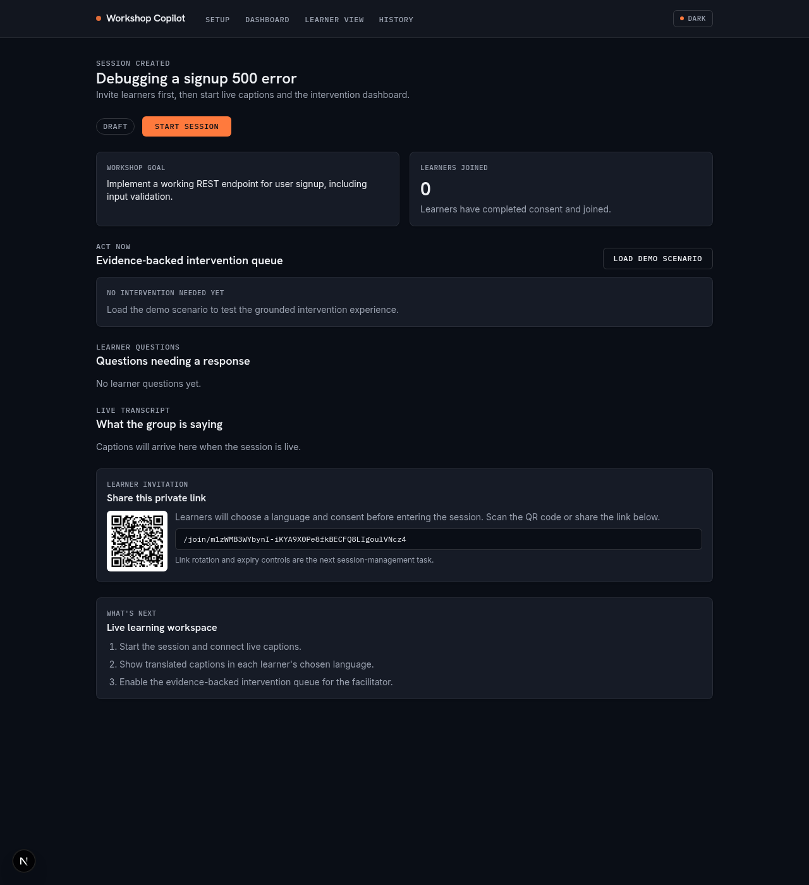
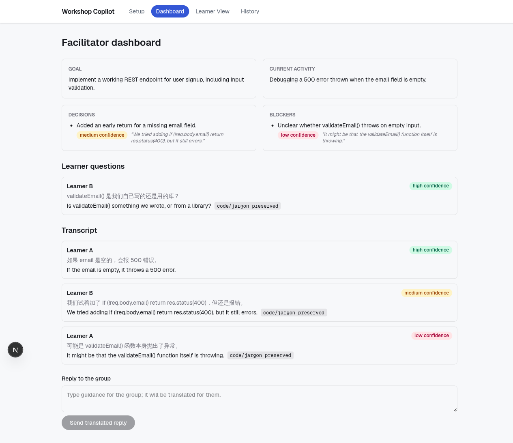
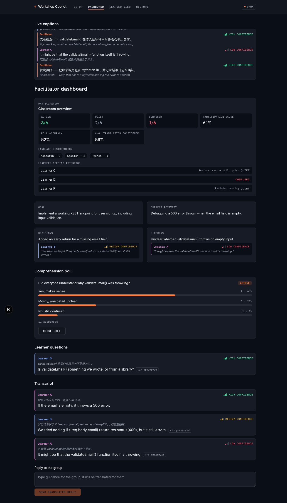
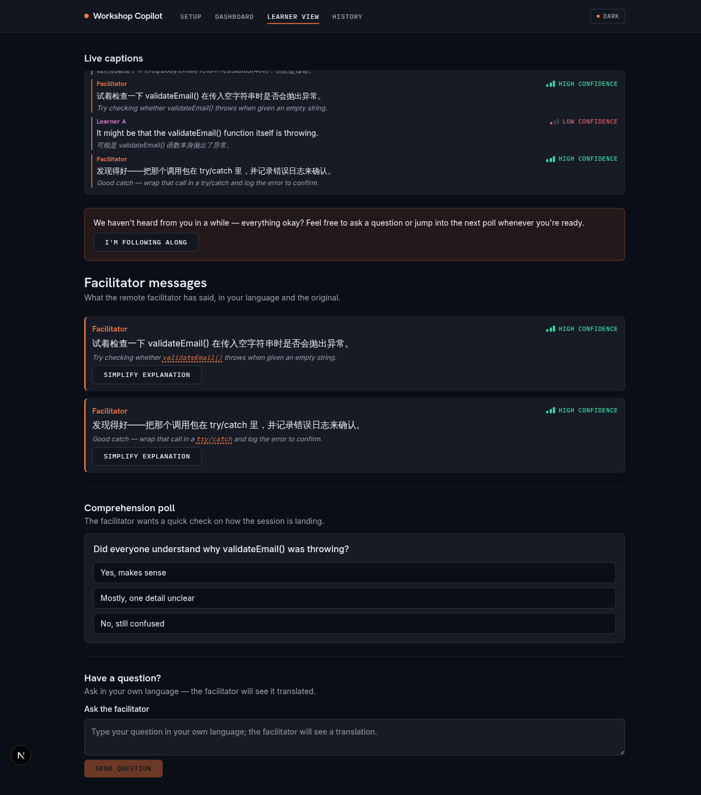
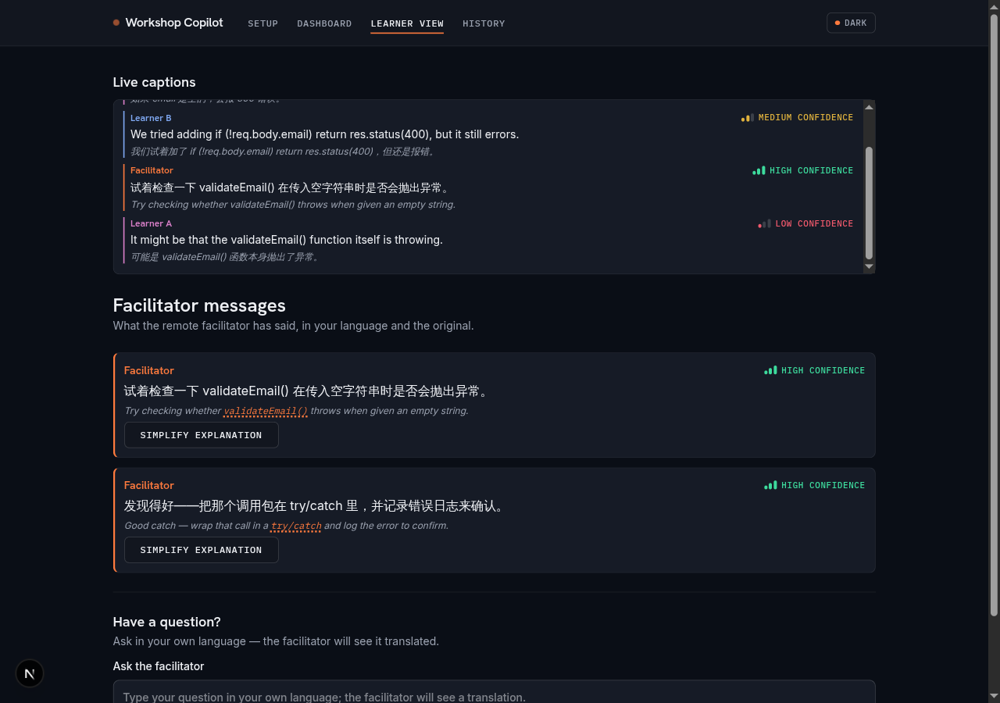
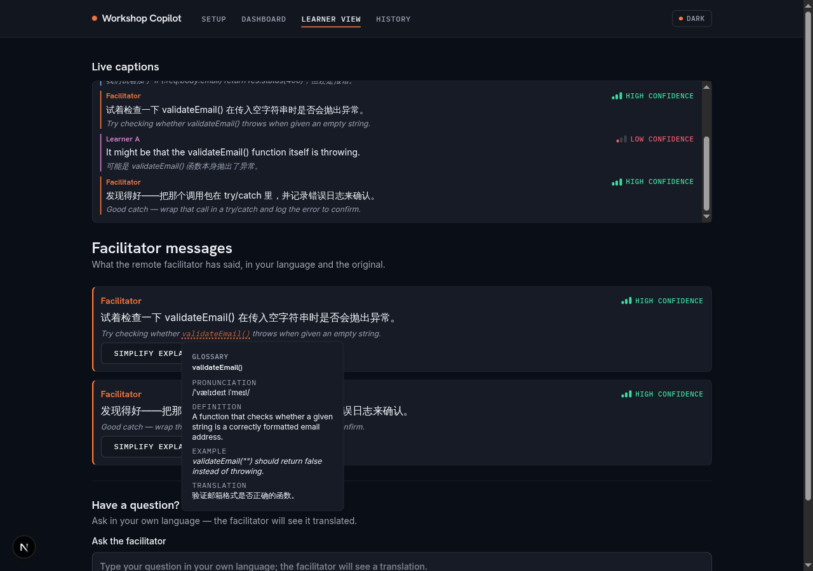
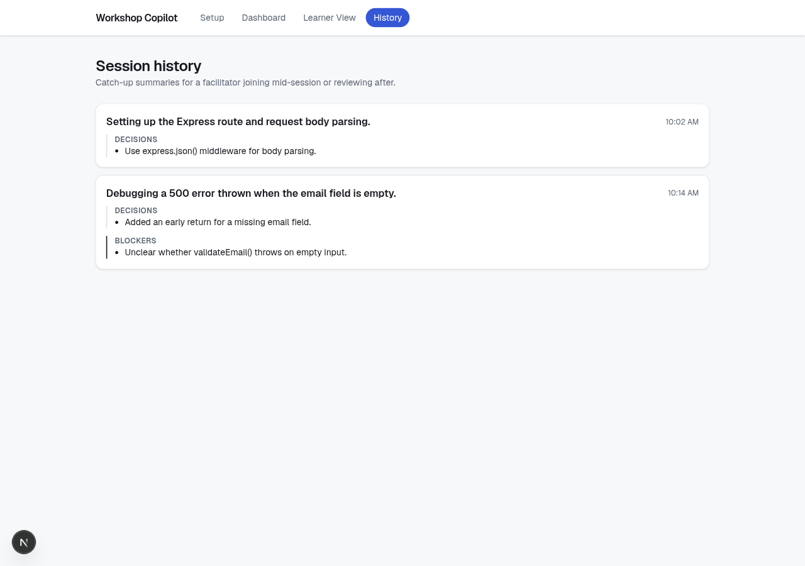
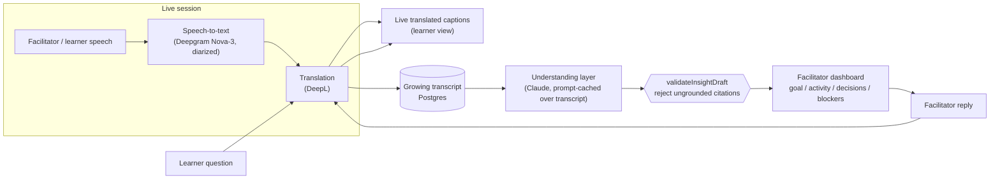

# 5-Minute Pitch Video — Recording Guide

A script and shot list for the "Breaking Language Barriers" hackathon pitch,
built around the demo scenario this repo already implements: a remote
facilitator supporting a hands-on coding workshop run in a language they
don't speak. Pair this with the screenshots in `docs/screenshots/` — every
beat below names the exact file to have on screen.

## Before you hit record

1. `npm run db:seed` — loads the "Debugging a signup 500 error" fixture
   (English facilitator, Chinese + Spanish learners) with a ready learner
   join link. This is the same fixture behind the screenshots in this repo.
2. `npm run dev`, open the facilitator dashboard in one window/tab and the
   learner view (via the seeded join link, or the QR code on `/setup`) in
   another — see `docs/screenshots/phase0-facilitator-qr.png`.

   

   
Show/hide screenshot

   

   

3. Have `docs/screenshots/setup.png` ready in case you want to show session
   creation instead of narrating it.

   

   
Show/hide screenshot

   

   

## Timing (5:00 total)

Read **Say** out loud, close to verbatim — it's word-counted to fit its time
slot at a normal speaking pace. **Show** tells you what's on screen while
you say it.

**0:00–0:40 · Problem**
- Show: Talking head, or the problem statement in `docs/problem_statement.md`.
- Say: "Online workshops run across languages every day. When a facilitator and a learner don't share one, the facilitator can't tell who's actually following — and a learner who's lost usually stays quiet instead of saying so. By the time anyone notices, the moment to help has already passed. That's the problem we're solving: helping facilitators and learners understand each other in real time, across languages, in a live learning session."

**0:40–1:15 · Approach**
- Show: Architecture diagram (below).
- Say: "Our approach: capture speech, transcribe and translate it live, and then have an AI layer read the growing transcript to track the goal, the current activity, decisions, and blockers — instead of leaving that tracking to an already-busy facilitator. Every one of those AI-generated insights is linked back to the exact line of transcript it came from, so nothing is invented."

**1:15–3:15 · Live demo**
- Show: Facilitator dashboard → learner join → learner question → quiet-learner nudge → glossary → history.
- Say: Follow the live demo script below almost word for word — it's written as an exact walkthrough, not a summary.

**3:15–4:15 · Why this is hard**
- Show: `src/lib/providers/insight.ts`, the `validateInsightDraft` function.
- Say: "This looks simple, but it's a three-stage pipeline — speech-to-text, translation, then AI summarization — and each stage can quietly lose accuracy. So we added a guardrail: before any AI-generated insight reaches the dashboard, we check that it only cites transcript lines from the batch it was actually generated from. If it cites anything outside that batch, we reject it. That's what stops the AI from inventing a decision nobody actually made."

**4:15–4:50 · Impact & feasibility**
- Show: Dashboard + terminal running `npm run db:seed`.
- Say: "This matters because a learner going quiet in a language the facilitator doesn't speak used to be invisible — now it's a card on the dashboard. It's a real prototype, not a slide: real sessions, real Postgres storage, role-scoped join links. And it's feasible today, because Deepgram, DeepL, and Claude are shipping APIs we can call right now, not research projects."

**4:50–5:00 · Close**
- Show: Talking head.
- Say: "That's Breaking Language Barriers: live translation plus grounded understanding, so no one gets left behind in their own workshop. Thank you."

## Live demo script (1:15–3:15)

Follow the facilitator → learner → facilitator loop so the video shows a
real round-trip, not just two static screens. Each beat below gives the
exact screen to be on and the exact line to say.

**1.**
- Show: `docs/screenshots/dashboard.png` — point at the goal card, then decisions/blockers.
- Say: "Here's the facilitator dashboard. The goal comes straight from setup. These decision and blocker cards weren't typed by anyone — they were pulled live from the transcript, and each one links back to the exact line it came from."

  

  
Show/hide screenshot

  

  

**2.**
- Show: `docs/screenshots/phase0-facilitator-qr.png` → scan/open → `docs/screenshots/learner.png`
- Say: "Now let's join as a learner, mid-session, in a different language — just by scanning this QR code. No account setup. And here's their view: the facilitator's words, captioned and translated live, with the original still visible underneath."

  

  
Show/hide screenshot

  

  

**3.**
- Show: `docs/screenshots/dashboard-learner-questions.png`
- Say: "The learner can ask a question in their own language. Watch it land on the facilitator's side — already translated. The facilitator replies here, and that reply is auto-translated back to the learner."

  

  
Show/hide screenshot

  

  

**4.**
- Show: `docs/screenshots/dashboard-quiet-escalation.png`, `docs/screenshots/learner-quiet-nudge.png`
- Say: "This is the part that doesn't exist anywhere else: when a learner goes quiet for too long, the facilitator gets nudged to check in — and the learner gets a gentle, low-pressure prompt too. Nobody has to notice the silence themselves."

  

  
Show/hide screenshots

  
  

  

**5.**
- Show: `docs/screenshots/ai-glossary-before.png` → `docs/screenshots/ai-glossary-after.png`
- Say: "One more thing worth thirty seconds: translation doesn't mangle code. `validateEmail()` and `req.body.email` come through untouched, every time."

  

  
Show/hide screenshots

  
  

  

**6.**
- Show: `docs/screenshots/history.png`
- Say: "And if a learner joins even later, they don't scroll a wall of transcript — they get this grounded catch-up summary instead."

  

  
Show/hide screenshot

  

  

If you're short on time, cut in this order (least to most essential):
glossary demo, quiet nudge, history — keep goal/decisions/blockers and the
live translated Q&A round-trip no matter what, since that's the challenge
statement's suggested demo almost verbatim.

## Architecture (for the 0:40–1:15 beat)

## Judging-criteria cheat sheet

Keep these three phrases ready to say out loud — they map directly onto
`docs/problem_statement.md`'s judging criteria so nothing you build reads as
generic:

- **Impact** — "a learner going quiet in a language the facilitator doesn't
  speak used to be invisible; now it's a card on the dashboard."
- **Prototype quality** — "this is a real Postgres-backed session with
  role-scoped join links, not a slide" — point at `npm run db:seed` and the
  opaque learner join token (`src/lib/session-security.ts`).
- **Innovation & feasibility** — "translation-only tools stop at the words;
  we ground an AI summary in the transcript with a citation guardrail so it
  can't invent a decision nobody made."
