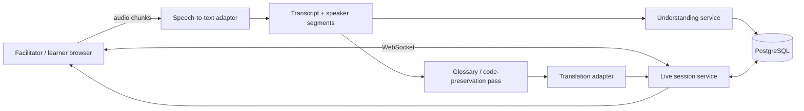
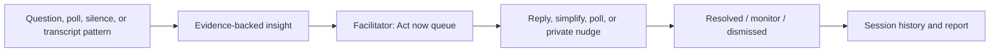
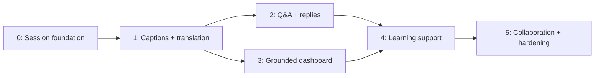

# Implementation Plan — Multilingual Learning Workshop

## Purpose and recommendation

The current repository is a strong **frontend prototype** of the confirmed
Live Status Dashboard approach: it has facilitator setup, dashboard, learner,
and history views, but all data comes from `src/lib/mock-data.ts` and form
submissions only update local component state. The next implementation should
turn that prototype into a single, dependable end-to-end session flow before
adding the broader feature list.

For the first working release, build these together:

1. live captions and translated text for one facilitator/learner language pair;
2. translated learner questions and facilitator replies;
3. quote-grounded dashboard updates (activity, decisions, blockers);
4. a technical glossary that protects code, commands, and named terms;
5. explicit consent, retention, and accessibility controls.

This matches the existing UI and the challenge's core requirement while
keeping the live demo reliable. Translated audio, polls, breakout-room
monitoring, whiteboard translation, and sign-language support should follow
only after this path is stable.

The product should have two deliberately different experiences, rather than a
single dashboard shown to everyone:

- **Learner:** a calm, caption-first learning workspace that makes the current
  explanation understandable, lets the learner ask or answer in their own
  language, and gives low-pressure ways to signal confidence or request help.
- **Facilitator:** an intervention workspace that answers three questions in
  order: *What is being taught? Who needs help now? What is the smallest useful
  action I can take?* It must make evidence and a recommended next action more
  prominent than raw analytics.

## Current-state assessment

| Area | What exists | Implementation gap |
| --- | --- | --- |
| User interface | Four routes: `/setup`, `/dashboard`, `/learner`, and `/history`; reusable cards, transcript, reply, and question components | Pages use fixed mock data and cannot share a real session |
| Session setup | Goal form and navigation | No session record, language selection, consent, upload, glossary, or join flow |
| Translation UX | Original/translated text, confidence buckets, and preserved-span marker are displayed | No speech capture, translation provider, confidence calculation, or term preservation logic |
| Facilitation | Goal/activity/decision/blocker cards link to source transcript IDs | No understanding service, evidence validation, or real-time update channel |
| History | Static summary cards | No persisted session timeline or post-session report |
| Platform | Next.js 16 / React 19 frontend | No database, authentication, API layer, live transport, provider configuration, or automated tests |

## Accounts, roles, session links, and persistence

Yes—introduce a database in Phase 0. PostgreSQL is the recommended shared
database because this is a multi-user, real-time application. It stores the
session, its participants, final transcript segments, translations, messages,
dashboard insights, polls, glossary terms, accessibility settings, consent,
and retention/deletion records. Raw audio should **not** be stored by default.

### Who the people are

| Role | Identity and access | Main responsibility | Default workspace |
| --- | --- | --- | --- |
| Facilitator | Authenticated user who creates the session; can invite co-facilitators | Sets goal/languages/privacy, monitors learning, responds and intervenes | Facilitator dashboard |
| Learner | Authenticated user or scoped invite participant; selects display name, preferred language, and accessibility settings | Follows content, asks/answers, signals confidence, controls their own participation | Learner workspace |
| Co-facilitator (later) | Authenticated invite with facilitator permissions but no ownership transfer | Supports Q&A and interventions | Facilitator dashboard |
| Observer / demo guest (optional) | Read-only, expiring invite | Watches a session without participant controls | Caption/transcript view |

### Session creation and join flow

1. A facilitator signs in and creates a session: title, goal, source language,
   enabled learner languages, scheduled/start state, retention option, and
   learning materials.
2. The server creates a `Session` record and an opaque, random `JoinLink`
   token. The facilitator sees a learner link and QR code, for example
   `https://app.example.com/join/<opaque-token>`—never a guessable session ID.
3. The learner opens the link, enters a name (or signs in), selects their
   language/accessibility preferences, reads the recording/processing notice,
   and explicitly consents before joining.
4. The join service validates the token, expiry, seat/role constraints, and
   session state; it then creates or updates `SessionParticipant` and issues a
   short-lived room credential.
5. Facilitators use their authenticated `/sessions/<session-id>/facilitator`
   route. Learners are redirected to `/sessions/<session-id>/learn`. A join
   token cannot grant facilitator access.

The facilitator can rotate, pause, set an expiry on, or revoke learner links.
Use separate signed, short-lived invitation records for co-facilitators and
observers. This provides frictionless attendee access inspired by Wordly's
link/QR-code entry pattern, without sacrificing role separation.

Add `JoinLink` (`sessionId`, `role`, `tokenHash`, `expiresAt`, `revokedAt`,
`maxUses`) and `SessionParticipant` (`sessionId`, `userId` or guest identity,
`role`, `preferredLanguage`, `consentedAt`, `joinedAt`, `lastActiveAt`) to the
core model. Hash stored tokens, expire them automatically, and audit creation,
use, rotation, and revocation.

## Target architecture

### Technology choices

Use provider adapters rather than coupling application code to any vendor:

- **Live transport:** LiveKit for rooms/audio and data messages, or a managed
  WebSocket service if video is explicitly out of scope for MVP.
- **Speech-to-text:** a streaming STT adapter (for example Deepgram or Soniox)
  that returns interim/final segments, language, timestamps, and speaker IDs.
- **Translation:** a text translation adapter (DeepL first for demo language
  coverage; fallback provider later). Keep a provider response's confidence or
  quality signal separate from the UI's high/medium/low bucket.
- **Understanding:** a structured-output LLM call run on final transcript
  segments only. It produces current activity, decisions, blockers, and source
  segment IDs; the server rejects a result that cites missing evidence.
- **Persistence:** PostgreSQL with Prisma or Drizzle. SQLite is acceptable only
  for an early local demo, not the multi-user deployment.
- **File ingestion:** extract text server-side from PDFs/slides; store the
  original file only when the facilitator has opted in.

All provider keys must remain server-only. The browser receives short-lived
room/session credentials, never provider API keys.

## Core domain model

Replace the current mock-only types with persisted equivalents. Important
records are:

| Entity | Key fields | Notes |
| --- | --- | --- |
| `User` | id, displayName, role, preferredLanguage, accessibilitySettings | Authentication can start as magic-link or demo access, but roles are required. |
| `Session` | id, goal, status, facilitatorId, sourceLanguage, retentionPolicy, startedAt, endedAt | Owns all live-session content. |
| `SessionParticipant` | sessionId, userId, preferredLanguage, consentedAt, joinedAt, lastActiveAt | Supports language distribution and quiet-participant logic later. |
| `TranscriptSegment` | id, sessionId, speakerId, originalText, language, timestamps, finality, STT metadata | Immutable final segments; interim captions are ephemeral. |
| `Translation` | segmentId, targetLanguage, text, provider, qualitySignal, preservedSpans | One segment can have several recipient-language translations. |
| `GlossaryTerm` | sessionId, sourceTerm, approvedTranslation, aliases, preserveVerbatim | Produced from uploads and editable by the facilitator. |
| `Insight` | id, sessionId, type, summary, status, createdAt | `type`: activity, decision, blocker, confusion, etc. |
| `InsightEvidence` | insightId, transcriptSegmentId | Enforces quote-grounded claims instead of an untraceable summary. |
| `Message` | sessionId, senderId, originalText, language, kind, sentAt | Covers chat, Q&A, and facilitator replies; translations are stored separately. |
| `Poll` / `PollResponse` | sessionId, question, options, status / participantId, answer | Deferred until the MVP's core is reliable. |
| `JoinLink` | sessionId, role, tokenHash, expiresAt, revokedAt, maxUses | Opaque learner/co-facilitator/observer invitations, never a public session ID. |

## Product information architecture and intervention UX

### Learner workspace: understand first, participate second

The learner page should be structured as:

1. **Now:** large live translated caption, current speaker, original-language
   toggle, translation-quality state, and optional translated-audio controls.
2. **Learning support:** session goal/current step, tap-to-open glossary and
   simplified explanation, with clear labels when content is AI-generated.
3. **Participation:** one prominent “Ask a question” action, chat/Q&A history,
   a low-friction “I need help” signal, and active poll. Never force a learner
   to speak to prove engagement.
4. **Catch up:** a short, source-linked recap for late joiners plus a readable
   transcript. Preferences for font size, contrast, caption placement, and
   keyboard/screen-reader use stay available throughout.

The immediate learning content must remain above analytics. Confidence prompts
should be optional, private by default, and worded as learning support (for
example, “Would another example help?”), not surveillance.

### Facilitator workspace: an intervention queue, not a wall of metrics

Organise the dashboard into these priority bands:

| Priority band | Shows | Facilitator action |
| --- | --- | --- |
| `Act now` | New learner questions, repeated confusion, weak translation, unanswered help requests, or an active low-confidence poll result | Reply in the learner's language, simplify/restate, launch a poll, or mark reviewed/dismissed |
| `Current lesson` | Goal, current activity, active decisions/blockers, latest translated quotes | Verify the system's understanding and correct/resolve an item |
| `Learning pulse` | Aggregate participation, confidence/poll trend, language distribution, and quiet-learner count | Drill into evidence; send an optional private nudge rather than publicly naming learners |
| `Transcript and history` | Searchable, translated source of truth, snapshots, decisions, and resolved interventions | Review, catch up, and export according to retention rules |

Every alert needs: a severity/reason, the supporting translated quote(s),
affected scope (one learner, group, or session), timestamp, confidence/quality
state, and one or two safe suggested actions. Dashboard insights must never
automatically interrupt a learner or submit a question on their behalf.

### Intervention lifecycle

This takes inspiration from Read AI's citation-backed search/answers and
action-item-oriented meeting recaps, but applies them to an instructor's
immediate intervention loop. Wordly's patterns—personal-device access,
preferred-language selection, two-way translation, and custom glossaries—are
the baseline for the learner experience. Our differentiator remains not simply
translating the room, but helping the facilitator act at the right moment.

Use an append-only transcript and insight history. Dashboard cards should show
the latest active insights, while `/history` reads timestamped snapshots.

## Delivery phases

### Phase 0 — Foundation and contracts

**Outcome:** a deployable application shell with a real session and a safe
development workflow.

- Read the relevant Next.js 16 guides in `node_modules/next/dist/docs/` before
  adding route handlers, server/client boundaries, or caching behaviour.
- Add environment validation for database, auth, LiveKit, STT, translation, and
  LLM settings; provide `.env.example` with no secrets.
- Add database schema, migrations, seed data, authentication, session roles,
  and authorization checks, including opaque role-scoped join links, QR-code
  generation, consent capture, expiry/revocation, and a learner join screen.
- Create typed server-side service interfaces: `SpeechToTextProvider`,
  `TranslationProvider`, `InsightProvider`, and `RoomProvider`.
- Create API contracts for session creation/joining, transcript events,
  translated messages, dashboard updates, and session completion.
- Add unit-test tooling and an end-to-end smoke test; preserve the existing
  static data as a development/demo fixture until the live path is complete.

**Acceptance criteria:** a facilitator can create a session and share an
expiring learner link; a learner can join with a preferred language and
consent; learner links cannot access facilitator routes; and neither role can
read or write another session's data.

### Phase 1 — Live transcript and translation vertical slice

**Outcome:** a learner hears/speaks in the demo language pair and both roles
receive attributable, translated final captions.

- Add microphone permissions, device selection, recording/processing consent,
  and connection/error states to the learner and facilitator views. Keep the
  learner's translated caption as the visual primary action.
- Stream audio to the chosen STT adapter; render interim captions without
  persistence and persist final segments with timestamps and speaker identity.
- Translate each final segment into the languages currently selected by session
  participants and publish the translation event through the live channel.
- Implement a glossary/code-preservation preprocessing step. Preserve fenced or
  inline code, identifiers, commands, URLs, error codes, and facilitator-set
  glossary terms; restore them after translation.
- Calculate an explainable confidence bucket from provider signals and rules;
  label unavailable confidence as `unknown`, not as a fabricated score.
- Convert `TranscriptEntryView` and dashboard quote rendering from mock imports
  to real session data, including language metadata and timestamps.

**Acceptance criteria:** final captions appear to connected participants within
the agreed demo latency target; a learner sees their preferred-language text;
code examples remain unchanged; reconnecting loads the persisted transcript.

### Phase 2 — Multilingual participation

**Outcome:** learner questions, chat messages, and facilitator replies work in
either supported language.

- Persist Q&A/chat messages as original-language text and create translations
  per recipient language.
- Replace `QuestionBox` and `ReplyBox` local confirmation states with optimistic
  mutations, delivery status, retry, and error feedback.
- Route questions to the facilitator dashboard with original text, translated
  text, source language, and quality state.
- Add message ordering, participant identity, rate limits, and basic abuse
  protection.
- Add an optional translated-audio playback adapter only after caption delivery
  is reliable; it must have stop/mute controls and never auto-play by default.

**Acceptance criteria:** a learner can ask in language A, the facilitator sees
language B plus the original, and a reply returns in the learner's preferred
language with delivery feedback.

### Phase 3 — Grounded facilitator dashboard

**Outcome:** the existing differentiator becomes live without making unsupported
claims.

- Batch final transcript segments on a short interval or semantic boundary and
  request structured insights from the LLM using the session goal and approved
  glossary.
- Require each activity, decision, or blocker to reference one or more final
  segment IDs. Validate references, deduplicate similar items, maintain item
  status (`active`, `resolved`, `superseded`), and keep the last known good
  state if the provider fails.
- Stream insight changes to the dashboard's `Act now` queue and `Current
  lesson` area, with click-through source quotes and translation-quality labels.
- Add an explicit facilitator control to mark an insight correct, edit it,
  dismiss it, resolve it, or act on it with a translated reply, simplification,
  poll, or private learner nudge. Use those actions as feedback only with
  consent.
- Produce periodic history snapshots and implement end-session summary,
  common-question list, and participation report.

**Acceptance criteria:** every dashboard assertion opens its source evidence;
invalid/missing citations are not displayed; a facilitator can correct an
insight; history remains visible after a page refresh.

### Phase 4 — Learning-support features

**Outcome:** add the highest-value features from the feature list without
destabilising the core flow.

Prioritise in this order:

1. Upload material and facilitator-editable session glossary.
2. One-click simplified explanation, visibly marked as AI-generated and linked
   to its source sentence.
3. AI glossary definition/pronunciation/examples in the learner view.
4. Manual and AI-suggested comprehension polls.
5. Confusion and quiet-participant signals, first as private learner nudges and
   only then as facilitator alerts.
6. AI raise-hand suggestion that requires learner confirmation before sending a
   translated question.

Each detection feature needs conservative thresholds, a visible explanation,
and an opt-out. Do not infer confusion or engagement from protected traits or
from microphone/video data beyond the agreed session activity signals.

### Phase 5 — Collaboration, accessibility, and production hardening

**Outcome:** broader collaboration features and a demonstrably accessible,
privacy-respecting product.

- Integrate a whiteboard such as Excalidraw; translate text objects as separate
  overlays rather than mutating the author's original content.
- Add breakout-room monitoring only from consented transcript/chat/poll signals;
  surface evidence and notify facilitators sparingly.
- Implement font scaling, high-contrast settings, full keyboard navigation,
  accessible live-region captions, caption position controls, and audio-only
  mode. Treat a sign-language avatar as a research/integration project, not an
  MVP promise.
- Add retention settings at session creation, per-user consent revocation,
  automatic scheduled deletion, export/delete requests, audit logs, encryption,
  and monitoring.
- Load-test the live event path, record latency/error metrics, test with both
  supported languages and technical jargon, and rehearse the recorded demo
  fallback.

## Security, privacy, and quality gates

- Ask for recording/processing consent before audio starts; show participants
  what providers process their data and how long it is retained.
- Default to short retention and delete raw audio immediately after streaming
  unless explicit recording is enabled. Retain only the minimum transcript and
  translations required by the selected policy.
- Enforce session membership and role authorization on every HTTP and live
  event; validate event schemas server-side and rate-limit client writes.
- Never expose transcripts to model providers beyond the permitted session
  scope. Redact secrets/API keys where feasible before insight prompts.
- Test all data access, provider adapters, glossary protection, citation
  validation, and retention jobs. Add browser-level tests for create/join,
  captions, question/reply, dashboard evidence, and keyboard-only operation.

## Delivery sequence and dependencies

The critical path is Phase 0 → Phase 1 → Phase 3. Polls, whiteboard work,
translated audio, and advanced analytics must not delay the working caption +
translation + evidence-backed dashboard demo.

## Decisions needed before implementation

1. Confirm the first demo language pair and whether the facilitator speaks the
   source language throughout.
2. Choose hosting/credential ownership and approve the paid/free-tier provider
   combination for LiveKit, STT, translation, and the insight model.
3. Set a concrete latency target for final captions and dashboard updates.
4. Define the default transcript retention period and whether raw audio is ever
   stored.
5. Decide whether MVP users authenticate or receive a scoped session invite.

## Initial implementation order

Start with Phase 0, then build one vertical slice through Phase 1 using the
existing coding-workshop mock scenario. Keep the present UI as a fixture mode
until live data meets the acceptance criteria, then replace each mock import
route by route. This gives the team a continuously demonstrable prototype
instead of a broad, partially connected feature set.
