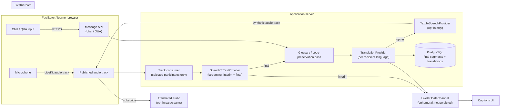

# Privacy-First Real-Time Translation Architecture

Closes #50. This document is the focused translation-system design the issue asks
for: live speech translation, live captions, chat/Q&A translation, and optional
translated audio, all built around LiveKit and a provider-abstraction layer so no
single vendor is load-bearing. It complements [`PLAN.md`](PLAN.md) (whole-product
delivery plan) and [`README.md`](../README.md#architecture) (current top-level
diagram) — this doc goes one level deeper on the translation pipeline itself and
answers the open questions raised in the issue.

## Current state vs. this design

The provider-abstraction pattern this document formalizes already exists in code:

| Boundary | File | Status |
| --- | --- | --- |
| `RoomProvider` | [`src/lib/providers/room.ts`](../src/lib/providers/room.ts) | Implemented — `LiveKitRoomProvider` issues short-lived, role-scoped JWTs |
| `TranslationProvider` | [`src/lib/providers/translation.ts`](../src/lib/providers/translation.ts) | Implemented — Claude Haiku text translation |
| `SpeechToTextProvider` | [`src/lib/providers/speech-to-text.ts`](../src/lib/providers/speech-to-text.ts) | Implemented — Deepgram Nova-3 per-chunk adapter; mock fallback when `STT_API_KEY` is unset |
| `InsightProvider` | [`src/lib/providers/insight.ts`](../src/lib/providers/insight.ts) | Mocked — used by the facilitator dashboard, not translation itself |

Callers already depend only on these interfaces, never on `livekit-server-sdk` or
the Claude SDK directly — this is the "translation abstraction layer" the issue
asks for, and it stays the contract that Text-to-Speech and streaming STT slot
into (see [Part 2](#part-2--live-captions-stt-integration) and
[Part 3](#part-3--voice-translation-tts) below).

## Screenshots — what's live today

Live captions (text-translation path) are already running end-to-end in the demo
app, driven by `TranslationProvider` above:

| Facilitator dashboard | Learner view |
| --- | --- |
|  |  |

These prove out the caption *delivery and display* half of this design. What's
missing to satisfy the issue's full scope is the *audio capture* half — streaming
speech-to-text — and optional translated audio playback, both covered below.

## Design principles (answers the issue's "Privacy Requirements" section)

1. **No raw audio storage by default.** Audio is streamed to the STT provider and
   discarded once a final transcript segment is produced. `Session.retentionPolicy`
   (see `PLAN.md`) controls whether a facilitator can opt in to recording.
2. **Provider swap without app changes.** All three translation-pipeline stages
   (STT, MT, TTS) sit behind interfaces in `src/lib/providers/`. Swapping Deepgram
   for a self-hosted faster-whisper instance, or Claude for LibreTranslate, is a
   new class + one line of wiring, not a rewrite.
3. **Explicit consent before any audio leaves the device.** The learner join flow
   (`PLAN.md`, Phase 0) requires consent capture before microphone access is
   requested; consent state is stored per-participant, not assumed.
4. **Self-hosted mode is a first-class deployment target, not an afterthought.**
   Every adapter has a self-hostable option (faster-whisper for STT, LibreTranslate
   or NLLB for MT, Piper/Coqui for TTS) so a facilitator with strict data-residency
   requirements can run the whole pipeline without external API calls.
5. **Server-only credentials.** Provider API keys never reach the browser — the
   browser only ever receives a short-lived LiveKit room token
   (`RoomProvider.issueCredential`), matching what's already implemented.

## End-to-end pipeline

Captions travel over LiveKit **DataChannels**, not a side WebSocket — this answers
one of the issue's LiveKit-integration questions directly: reusing the existing
room's reliable data channel avoids standing up a second real-time transport, and
keeps captions naturally scoped to room membership/auth that LiveKit already
enforces.

## Part 1 — Live speech translation

**Approach:** option 2 from the issue ("translation service processes selected
participant streams only"), not option 3 (interpreter-style bot participants).
Reasoning: bot participants add a publish/subscribe hop and per-language audio
tracks that don't scale past a couple of languages in a room; a server-side
consumer that subscribes to only the currently-speaking participant's track keeps
GPU/API load proportional to active speakers, not room size.

- The server holds a LiveKit **egress/track subscriber** connection (using the
  same `livekit-server-sdk` already a dependency) and subscribes only to
  participants who are unmuted and currently speaking, determined by LiveKit's
  active-speaker events — not every participant's stream all the time.
- Audio chunks are streamed to `SpeechToTextProvider` (interface already defined).
  Interim segments render immediately client-side and are never persisted; final
  segments are persisted and immediately translated per-recipient-language via
  `TranslationProvider`.
- **Per-user vs. per-workshop-language translation:** translate once per *distinct
  target language currently selected by connected participants*, not once per
  user. A 30-learner room with 3 languages does 3 translations per segment, not
  30 — this is the concrete scalability lever for cost and latency.

## Part 2 — Live captions (STT integration)

**Shipped so far:** `SpeechToTextProvider` has a real Deepgram Nova-3 adapter
(`DeepgramSpeechToTextProvider` in `speech-to-text.ts`) with two capabilities:
`transcribeChunk` (one-shot, prerecorded `/listen` REST — used for a full
pre-recorded clip) and `openStream` (Deepgram's live websocket API, used by
the facilitator's live-caption control). The facilitator page's
`LiveCaptionStream` component streams mic audio in ~250ms `MediaRecorder`
frames over a WebSocket to `/api/captions/stream` (built with
`experimental_upgradeWebSocket` from `@vercel/functions`, so it runs on
Vercel Functions/Fluid Compute with no separate WebSocket server). The route
authenticates the facilitator on the plain HTTP `GET` before upgrading, opens
a Deepgram streaming session per connection, and on every **final** segment
calls `publishTranslatedCaption` (`src/lib/captions.ts`) — the same helper
`publishCaption` uses for typed captions — which translates per learner
language, persists a `TranscriptSegment`, and pushes the DataChannel signal
below.

Delivery is DataChannel-signaled: `RoomProvider.notifyCaptionsChanged` sends a
lightweight "captions changed" message over a LiveKit DataChannel (topic
`captions`) to every room participant after a segment is persisted; a
`CaptionChannelRefresher` mounted inside `<LiveKitRoom>` triggers an immediate
`router.refresh()` on receipt. The DataChannel only carries a signal, not the
caption payload itself, so clients always re-fetch the authoritative
translated text from the server rather than trusting an unauthenticated data
message. `SessionAutoRefresh`'s 2s poll remains as a fallback for viewers who
haven't joined the LiveKit room yet (or if the push itself fails).

**Server-side track subscription** — so captions work without the
facilitator's own mic UI — is now scaffolded in `agent/`, a standalone
[LiveKit Agents](https://docs.livekit.io/agents/) worker. It's deliberately a
separate package (own `package.json`, not a dependency of the Next.js app):
it needs a persistent, long-running process, which doesn't fit Vercel
Functions, and `@livekit/agents` is an 18MB+ dependency tree with native/
ffmpeg bits that shouldn't bloat the app's install/deploy. The worker
subscribes to the `facilitator:*` participant's audio track, streams it
through the same `SpeechToTextProvider.openStream` boundary the browser mic
path uses, and publishes final transcripts to a new authenticated endpoint,
`/api/captions/agent` (shared-secret protected via `CAPTION_AGENT_SECRET`),
rather than importing `@/lib/db`/`@/lib/captions` directly — an earlier draft
tried the direct import and it broke: the generated Prisma client's
`export * from "./enums"` doesn't propagate through `tsx`/esbuild's module
resolution the way it does through Next's bundler, so `SessionStatus` came
back `undefined` outside of Next. See `agent/README.md` for env vars and the
full rationale.

**Where this stands is a deploy decision, not a build one.** The worker code
exists and passes local import/typecheck verification, but running a full
session through it end-to-end needs LiveKit Cloud + Deepgram credentials this
environment doesn't have, and the repo still hasn't picked a host for a
persistent process (a small VM, Fly.io, Railway, etc.) — that choice is
explicitly deferred to whoever deploys this.

**Streaming STT choice:** Deepgram Nova-3 for the managed default (already named
in `README.md`'s tech stack — diarization support matters for speaker
identification) with `faster-whisper` as the self-hosted alternative behind the
same `SpeechToTextProvider` interface, satisfying the issue's "self-hosted
deployment" privacy requirement without a second interface.

**Caption delivery decision (answers the issue's caption questions directly):**

| Question | Decision |
| --- | --- |
| DataChannels or something else? | LiveKit reliable DataChannel messages. **Shipped:** a signal-only message (topic `captions`) that triggers a refetch — simple and never drifts from the DB, but re-fetches the whole transcript per event. **Designed, not yet built:** carry the segment payload itself, keyed by `segmentId`, so late-joiners can request replay of the last N final segments without a full refetch |
| Central or distributed generation? | Centralized — one server-side consumer per active speaker; distributing STT to each client would leak provider API keys to the browser |
| Sync with video? | Final segments carry `startedAt`/`endedAt` from the STT provider; client renders captions against local playback clock, no server-side muxing needed since LiveKit already keeps audio/video in sync per track |

Speaker identification comes from the LiveKit participant identity attached to
the subscribed track (`role:identity` scheme already used in
`RoomProvider.issueCredential`) — no separate diarization-to-participant mapping
service is needed for the 1-speaker-at-a-time workshop format this app targets;
Deepgram diarization is reserved for the case where `Consumer` picks up
overlapping speech within one track.

## Part 3 — Voice translation (TTS)

- **Opt-in only, never auto-play** — matches the issue's privacy question
  directly. A learner enables "translated audio" in their preferences; nothing
  is synthesized for them until they do.
- **Delivery as a synthetic LiveKit participant, scoped per-language, not
  per-listener.** One `interpreter-<lang>` bot participant per *distinct*
  requested target language publishes a synthesized audio track; any learner who
  opted into that language subscribes to that track. This reuses LiveKit's
  existing publish/subscribe fan-out instead of the server transcoding N
  individual streams.
- **Self-hosted option:** Piper or Coqui TTS behind the same
  `TextToSpeechProvider` interface pattern as the other two adapters, for
  fully self-hosted deployments.
- Voice output is deferred to *after* captions are reliable (Phase 1 of
  `PLAN.md` before Phase 2's voice work) — captions alone satisfy the "is
  translated audio required" open question for the MVP; audio is additive.

## Part 4 — Chat and Q&A translation

Already implemented for text (`translateText` in `src/lib/providers/translation.ts`,
wired through `SessionChatPanel.tsx`). This section only adds the pieces the
issue asks about that aren't yet decided:

- **Store original and translated separately, always show original on demand.**
  The `Message`/`Translation` split in `PLAN.md`'s domain model already does
  this — never overwrite a sender's original text.
- **Retention:** translated messages follow the same `Session.retentionPolicy`
  as transcript segments; there is no separate retention policy for chat, to
  avoid two conflicting deletion schedules for content from the same session.
- **Formatting/emoji/links:** the glossary/code-preservation pass (already
  planned for spoken transcript) applies identically to chat text before it
  reaches `TranslationProvider`, so URLs, code spans, and preserved terms
  survive translation unchanged; emoji pass through untouched since they're
  non-translatable Unicode.

## Technology comparison (issue's "Translation Technology Options")

| Stage | Self-hosted option | Managed option | Chosen default | Why |
| --- | --- | --- | --- | --- |
| STT | faster-whisper | Deepgram Nova-3 | Deepgram (managed) | Streaming interim/final segments and diarization out of the box; self-hosted faster-whisper is the privacy-mode fallback but needs GPU capacity planning |
| MT | LibreTranslate / NLLB / Marian NMT | Claude, DeepL, Google, Microsoft | Claude (managed) | Already implemented (`translation.ts`); strong quality on English/Chinese/Spanish (this app's `SupportedLanguage` set) without per-language-pair model management. LibreTranslate is the self-hosted fallback when `CLAUDE_API_KEY` is intentionally unset |
| TTS | Piper / Coqui | Provider-native TTS | Piper (self-hosted default) | Keeps the opt-in voice feature cheap to run per-language-bot rather than per-listener; managed TTS is a config swap behind `TextToSpeechProvider` if quality needs outweigh cost |

Every "managed" choice above is reachable purely by configuring an API key;
every "self-hosted" choice needs zero external network calls once deployed —
this is what makes "disable external translation providers" (an explicit privacy
requirement in the issue) a deployment-time flag rather than a code change.

## Performance and scalability targets

Matches the issue's stated latency targets, translated into concrete budgets
against this pipeline:

| Segment | Budget | Where it's spent |
| --- | --- | --- |
| Speech recognition (interim) | < 1s | Deepgram streaming interim results |
| Translation | < 1s | Claude Haiku (chosen over larger models specifically for this latency budget) |
| Caption delivery | < 200ms | LiveKit reliable DataChannel, same room the audio already flows through |
| End-to-end (speech → translated caption) | 2–5s | Sum of the above plus final-segment debounce (STT providers finalize a few hundred ms after speech ends) |

**Scalability lever:** cost and compute scale with *distinct active languages in
a room* and *concurrent speakers*, not with participant count — a direct
consequence of the per-language (not per-user) translation and per-active-speaker
(not per-participant) STT subscription decisions above. A 200-learner room with 3
languages costs the same as a 20-learner room with 3 languages.

## Open questions from the issue — resolved

| Question | Resolution |
| --- | --- |
| Per-user or per-workshop-language translation? | Per distinct target language currently in use (see Part 1) |
| Should translated audio be available to every participant? | No — opt-in per learner (Part 3) |
| DataChannels for captions? | Yes (Part 2) |
| Central or distributed caption generation? | Centralized, one consumer per active speaker |
| Translated audio as a separate LiveKit participant? | Yes, one bot per target language, not per listener |
| Should users opt-in before receiving generated speech? | Yes, explicit per-learner preference, never default-on |
| Self-hosted or hybrid default? | Hybrid default (managed STT/MT for demo quality), full self-hosted path available for every stage via the same provider interfaces |
| Should translated messages be stored permanently? | Same retention policy as the session's transcript, not permanent by default |
| Should users view original text? | Always available, never overwritten |

## Relationship to existing docs

- [`README.md`](../README.md#architecture) — current shipped architecture diagram and tech stack.
- [`docs/PLAN.md`](PLAN.md) — full product delivery plan (this doc is a deep-dive on PLAN.md's `STT`/`Translate` boxes and Phase 1–2 acceptance criteria).
- [`docs/superpowers/specs/2026-07-23-live-caption-ticker-design.md`](superpowers/specs/2026-07-23-live-caption-ticker-design.md) — caption UI implementation that this pipeline feeds.
- [`docs/superpowers/specs/2026-07-23-multilingual-chat-design.md`](superpowers/specs/2026-07-23-multilingual-chat-design.md) — chat UI that Part 4 feeds.
