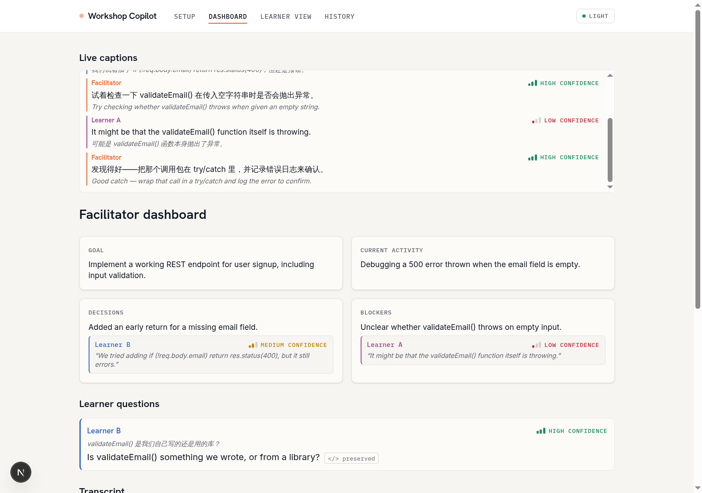
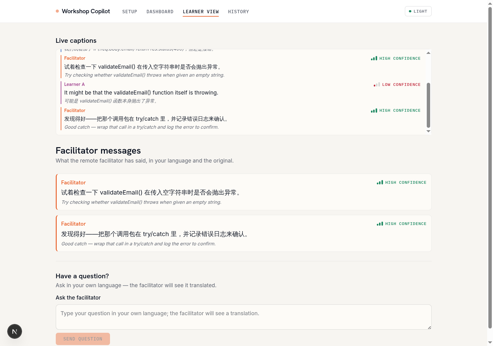
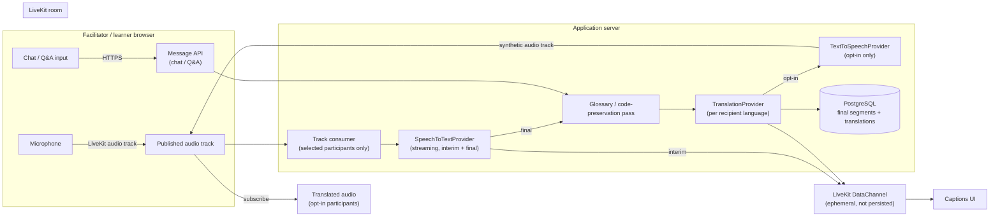

# Privacy-First Real-Time Translation Architecture

Closes #50. This document is the focused translation-system design the issue asks
for: live speech translation, live captions, chat/Q&A translation, and optional
translated audio, all built around LiveKit and a provider-abstraction layer so no
single vendor is load-bearing. It complements [`PLAN.md`](PLAN.md) (whole-product
delivery plan) and [`README.md`](../README.md#architecture) (current top-level
diagram) — this doc goes one level deeper on the translation pipeline itself and
answers the open questions raised in the issue.

## Current state vs. this design

The provider-abstraction pattern this document formalizes already exists in code:

| Boundary | File | Status |
| --- | --- | --- |
| `RoomProvider` | [`src/lib/providers/room.ts`](../src/lib/providers/room.ts) | Implemented — `LiveKitRoomProvider` issues short-lived, role-scoped JWTs |
| `TranslationProvider` | [`src/lib/providers/translation.ts`](../src/lib/providers/translation.ts) | Implemented — Claude Haiku text translation |
| `SpeechToTextProvider` | [`src/lib/providers/speech-to-text.ts`](../src/lib/providers/speech-to-text.ts) | Implemented — Deepgram Nova-3 per-chunk adapter; mock fallback when `STT_API_KEY` is unset |
| `InsightProvider` | [`src/lib/providers/insight.ts`](../src/lib/providers/insight.ts) | Mocked — used by the facilitator dashboard, not translation itself |

Callers already depend only on these interfaces, never on `livekit-server-sdk` or
the Claude SDK directly — this is the "translation abstraction layer" the issue
asks for, and it stays the contract that Text-to-Speech and streaming STT slot
into (see [Part 2](#part-2--live-captions-stt-integration) and
[Part 3](#part-3--voice-translation-tts) below).

## Screenshots — what's live today

Live captions (text-translation path) are already running end-to-end in the demo
app, driven by `TranslationProvider` above:

| Facilitator dashboard | Learner view |
| --- | --- |
|  |  |

These prove out the caption *delivery and display* half of this design. What's
missing to satisfy the issue's full scope is the *audio capture* half — streaming
speech-to-text — and optional translated audio playback, both covered below.

## Design principles (answers the issue's "Privacy Requirements" section)

1. **No raw audio storage by default.** Audio is streamed to the STT provider and
   discarded once a final transcript segment is produced. `Session.retentionPolicy`
   (see `PLAN.md`) controls whether a facilitator can opt in to recording.
2. **Provider swap without app changes.** All three translation-pipeline stages
   (STT, MT, TTS) sit behind interfaces in `src/lib/providers/`. Swapping Deepgram
   for a self-hosted faster-whisper instance, or Claude for LibreTranslate, is a
   new class + one line of wiring, not a rewrite.
3. **Explicit consent before any audio leaves the device.** The learner join flow
   (`PLAN.md`, Phase 0) requires consent capture before microphone access is
   requested; consent state is stored per-participant, not assumed.
4. **Self-hosted mode is a first-class deployment target, not an afterthought.**
   Every adapter has a self-hostable option (faster-whisper for STT, LibreTranslate
   or NLLB for MT, Piper/Coqui for TTS) so a facilitator with strict data-residency
   requirements can run the whole pipeline without external API calls.
5. **Server-only credentials.** Provider API keys never reach the browser — the
   browser only ever receives a short-lived LiveKit room token
   (`RoomProvider.issueCredential`), matching what's already implemented.

## End-to-end pipeline

Captions travel over LiveKit **DataChannels**, not a side WebSocket — this answers
one of the issue's LiveKit-integration questions directly: reusing the existing
room's reliable data channel avoids standing up a second real-time transport, and
keeps captions naturally scoped to room membership/auth that LiveKit already
enforces.

## Part 1 — Live speech translation

**Approach:** option 2 from the issue ("translation service processes selected
participant streams only"), not option 3 (interpreter-style bot participants).
Reasoning: bot participants add a publish/subscribe hop and per-language audio
tracks that don't scale past a couple of languages in a room; a server-side
consumer that subscribes to only the currently-speaking participant's track keeps
GPU/API load proportional to active speakers, not room size.

- The server holds a LiveKit **egress/track subscriber** connection (using the
  same `livekit-server-sdk` already a dependency) and subscribes only to
  participants who are unmuted and currently speaking, determined by LiveKit's
  active-speaker events — not every participant's stream all the time.
- Audio chunks are streamed to `SpeechToTextProvider` (interface already defined).
  Interim segments render immediately client-side and are never persisted; final
  segments are persisted and immediately translated per-recipient-language via
  `TranslationProvider`.
- **Per-user vs. per-workshop-language translation:** translate once per *distinct
  target language currently selected by connected participants*, not once per
  user. A 30-learner room with 3 languages does 3 translations per segment, not
  30 — this is the concrete scalability lever for cost and latency.

## Part 2 — Live captions (STT integration)

**Shipped so far:** `SpeechToTextProvider` has a real Deepgram Nova-3 adapter
(`DeepgramSpeechToTextProvider` in `speech-to-text.ts`) with two capabilities:
`transcribeChunk` (one-shot, prerecorded `/listen` REST — used for a full
pre-recorded clip) and `openStream` (Deepgram's live websocket API, used by
the facilitator's live-caption control). The facilitator page's
`LiveCaptionStream` component streams mic audio in ~250ms `MediaRecorder`
frames over a WebSocket to `/api/captions/stream`. The upgrade itself is
handled by the custom Node server (`server.ts`) that Railway runs, using `ws`
directly — Next route handlers can't perform a raw WebSocket upgrade on their
own, so `server.ts` intercepts the HTTP `upgrade` event for this path before
it reaches Next's router at all. `server.ts` authenticates the facilitator
(parsing the facilitator cookie off the raw upgrade request, via
`verifyFacilitatorToken` in `session-access.ts`) before upgrading, then hands
the socket to `attachCaptionSocket` (`src/lib/captions-socket.ts`), which
opens a Deepgram streaming session per connection, and on every **final** segment
calls `publishTranslatedCaption` (`src/lib/captions.ts`) — the same helper
`publishCaption` uses for typed captions — which translates per learner
language, persists a `TranscriptSegment`, and pushes the DataChannel signal
below.

Delivery is DataChannel-signaled: `RoomProvider.notifyCaptionsChanged` sends a
lightweight "captions changed" message over a LiveKit DataChannel (topic
`captions`) to every room participant after a segment is persisted; a
`CaptionChannelRefresher` mounted inside `<LiveKitRoom>` triggers an immediate
`router.refresh()` on receipt. The DataChannel only carries a signal, not the
caption payload itself, so clients always re-fetch the authoritative
translated text from the server rather than trusting an unauthenticated data
message. `SessionAutoRefresh`'s 2s poll remains as a fallback for viewers who
haven't joined the LiveKit room yet (or if the push itself fails).

**Server-side track subscription** — so captions work without the
facilitator's own mic UI — lives in `src/lib/caption-agent.ts`, a
[LiveKit Agents](https://docs.livekit.io/agents/) worker registered directly
from `server.ts` (the app's custom Node server, already a persistent process
on Railway). It's a single deployable service/`package.json` with the rest of
the app now, not a standalone one — this repo is a hackathon project, not a
long-term production system, so the earlier microservice split (own
`package.json`, own Railway service, talking to the app over HTTP) wasn't
worth the operational overhead. The worker subscribes to the `facilitator:*`
participant's audio track, streams it through the same
`SpeechToTextProvider.openStream` boundary the browser mic path uses, and
publishes final transcripts via `publishTranslatedCaption` directly — no HTTP
hop or shared secret needed now that the worker and the rest of the app share
one process/module graph. (An earlier standalone-package draft had to route
through HTTP because the generated Prisma client's `export * from
"./enums"` didn't propagate through `tsx`/esbuild's module resolution from a
separate `agent/node_modules` the way it does through Next's bundler, so
`SessionStatus` came back `undefined`; running in the same `tsx`-loaded
process as `server.ts` — which already imports `@/generated/prisma/client`
successfully — sidesteps that.)

LiveKit Agents still forks a subprocess per job dispatch (its own job
isolation model, preserving `tsx`'s `execArgv` so the forked process can still
load the `.ts` entry file) — that's internal to the worker, not a second
deployable service.

**Verified locally** against a real LiveKit Cloud project: `server.ts`
registers the worker successfully on startup (`starting worker` /
`registered worker` in the logs) alongside the Next.js app on the same port.
Running a full session through it end-to-end (facilitator audio →
`trackSubscribed` → Deepgram → `publishTranslatedCaption`) still needs a live
LiveKit room with a connected facilitator to confirm, which wasn't set up in
this environment. `server.ts` no-ops the worker registration entirely when
`LIVEKIT_URL`/`LIVEKIT_API_KEY`/`LIVEKIT_API_SECRET`/`STT_API_KEY` aren't all
set, so local dev without those still starts cleanly.

**Streaming STT choice:** `faster-whisper` (self-hosted, via `local-inference/`)
is now the default, tried first behind `SpeechToTextProvider.openStream`; Deepgram
Nova-3 (diarization support matters for speaker identification) is the automatic
cloud fallback on local failure. See Part 5 for the chunked-buffering design this
required (faster-whisper has no websocket streaming API of its own) and the
per-session strict-privacy toggle that disables the fallback.

**Caption delivery decision (answers the issue's caption questions directly):**

| Question | Decision |
| --- | --- |
| DataChannels or something else? | LiveKit reliable DataChannel messages. **Shipped:** a signal-only message (topic `captions`) that triggers a refetch — simple and never drifts from the DB, but re-fetches the whole transcript per event. **Designed, not yet built:** carry the segment payload itself, keyed by `segmentId`, so late-joiners can request replay of the last N final segments without a full refetch |
| Central or distributed generation? | Centralized — one server-side consumer per active speaker; distributing STT to each client would leak provider API keys to the browser |
| Sync with video? | Final segments carry `startedAt`/`endedAt` from the STT provider; client renders captions against local playback clock, no server-side muxing needed since LiveKit already keeps audio/video in sync per track |

Speaker identification comes from the LiveKit participant identity attached to
the subscribed track (`role:identity` scheme already used in
`RoomProvider.issueCredential`) — no separate diarization-to-participant mapping
service is needed for the 1-speaker-at-a-time workshop format this app targets;
Deepgram diarization is reserved for the case where `Consumer` picks up
overlapping speech within one track.

## Part 3 — Voice translation (TTS)

**Revision (2026-07-28):** the live in-meeting path now ships the
per-target-language track design this section originally called for — see
`docs/DUB_AUDIO_TRACK_MIGRATION.md` for the full detail. The per-listener
on-demand HTTP design described below (`TranslatedAudioPlayer`) turned out to
be a real source of fragility (unsynchronized against the raw-mic-ducking
path, silent-failure modes, a reconnect-loop regression — see
`docs/CAPTION_AUDIO_TROUBLESHOOTING.md`), and was retired **for the live
meeting only**; it's kept, unchanged, for the post-session transcript recap
replay (`facilitator/page.tsx`/`learn/page.tsx`'s `ENDED` branch), which has
no live LiveKit room to publish a track into. The rest of this section is
left as historical context for that decision.

**Shipped originally:** `TextToSpeechProvider` (`text-to-speech.ts`) with a mock
(no audio, until `TTS_API_KEY` is set) and an ElevenLabs adapter. The
learner page shows an opt-in "Play translated audio for new captions"
checkbox (`TranslatedAudioPlayer`) only when the provider is configured —
**nothing is synthesized or played until the learner explicitly checks it**,
per the decision below. When enabled, each new caption is fetched on demand
from `/api/captions/[segmentId]/audio?lang=<preferredLanguage>` and queued
for sequential playback so overlapping captions don't talk over each other.

- **Opt-in only, never auto-play** — matches the issue's privacy question
  directly. A learner enables "translated audio"; nothing is synthesized for
  them until they do. **Shipped as designed**, and still true for the recap
  player; the live path (below) auto-plays a cross-language dub by default,
  same as it always did — only *how* that audio reaches the listener changed.
- **Delivery is per-listener, not the designed per-language interpreter
  participant** *(original tradeoff — since revised, live-meeting only)*. The
  doc's original design was one `interpreter-<lang>` bot participant per
  distinct target language publishing a synthesized LiveKit audio track,
  reusing LiveKit's publish/subscribe fan-out instead of transcoding per
  listener. What shipped instead, for a while: synthesize-on-request per
  segment per listener, streamed back over a plain HTTP route. This was a
  deliberate scope cut — the interpreter-participant design needs the same
  always-on-process tradeoff as `src/lib/caption-agent.ts`'s track-subscription worker (a
  persistent bot participant per language, running as its own long-lived
  process), and building a second piece of always-on infrastructure in the
  same phase as the first wasn't worth it yet.
  **Now revised:** rather than a *separate* bot-per-language (its own LiveKit
  Cloud connection, multiplying exposure to this deployment's documented
  intermittent connectivity failures), the already-connected
  `caption-agent.ts` worker itself publishes one `dub-<language>` track per
  target language — see `docs/DUB_AUDIO_TRACK_MIGRATION.md`.
- **Self-hosted option:** Piper, behind the same `TextToSpeechProvider`
  interface — **shipped** in `local-inference/` (Part 5) and now the default,
  tried before ElevenLabs. ElevenLabs is the automatic cloud fallback on local
  failure. Both tiers now return raw PCM (Piper's WAV natively; ElevenLabs
  requested as `output_format=pcm_*`) rather than MP3 — this app has no MP3
  decoder, and the dub-track pipeline needs raw samples regardless.
- Voice output shipped *after* captions were hardened (streaming STT +
  DataChannel delivery, #56/#57/#58) — captions alone satisfied the "is
  translated audio required" open question for the MVP; audio is additive.

## Part 4 — Chat and Q&A translation

Already implemented for text (`translateText` in `src/lib/providers/translation.ts`,
wired through `SessionChatPanel.tsx`). This section only adds the pieces the
issue asks about that aren't yet decided:

- **Store original and translated separately, always show original on demand.**
  The `Message`/`Translation` split in `PLAN.md`'s domain model already does
  this — never overwrite a sender's original text.
- **Retention:** translated messages follow the same `Session.retentionPolicy`
  as transcript segments; there is no separate retention policy for chat, to
  avoid two conflicting deletion schedules for content from the same session.
- **Formatting/emoji/links:** the glossary/code-preservation pass (already
  planned for spoken transcript) applies identically to chat text before it
  reaches `TranslationProvider`, so URLs, code spans, and preserved terms
  survive translation unchanged; emoji pass through untouched since they're
  non-translatable Unicode.

## Part 5 — Self-hosted local-inference tier

**Shipped:** a standalone FastAPI service, `local-inference/` (the repo's
first Python component — still deliberately separate, since it's a different
language runtime with its own heavy ML dependency stack), running NLLB-600M-int8
translation (via CTranslate2), `faster-whisper` STT, and Piper TTS entirely
on-server. `TranslationProvider`/`SpeechToTextProvider`/`TextToSpeechProvider`
each try this service first (when `LOCAL_INFERENCE_URL`+`LOCAL_INFERENCE_SECRET`
are configured) and fall back to Claude/Deepgram/ElevenLabs automatically on
any local failure — no call site changes were needed, only the provider
implementations. See `local-inference/README.md` for the service itself and
its Railway deployment.

**Chunked STT, not true streaming.** `faster-whisper` has no websocket
streaming API like Deepgram's. `LocalBufferingSpeechToTextStream`
(`src/lib/providers/local-speech-buffer.ts`) buffers `openStream`'s incoming
audio into ~2.5s windows and transcribes each window as a whole via
`local-inference`'s plain REST `/stt/transcribe` endpoint, emitting only
`isFinal: true` segments — no interim/partial captions from this tier. This
is a deliberate MVP tradeoff (higher latency, far simpler) against true
incremental streaming, which is a possible fast-follow behind the same
`SpeechToTextProvider` interface.

**Sticky fallback.** If a local STT window fails, the buffering class opens
the cloud (Deepgram) stream once and routes all further audio there for the
rest of that connection — it never flaps back to local mid-stream, which
would risk duplicate or dropped segments.

**Strict-privacy toggle.** `Session.translationMode` (`AUTO` default,
`LOCAL_ONLY` opt-in at session creation) controls whether the automatic cloud
fallback is allowed at all. Every provider call site loads the session's mode
and passes `allowCloudFallback: session.translationMode !== "LOCAL_ONLY"`
into the corresponding `translate`/`transcribeChunk`/`openStream`/`synthesize`
call. Under `LOCAL_ONLY`, a local failure degrades straight to the existing
"unavailable" outcomes (`null` for translation, a thrown error for STT/TTS)
instead of ever calling a cloud API — the existing `common.translationUnavailable`
UI state needed no changes to support this.

**Known limitations:** Piper's Mandarin voice (`zh_CN-huayan-medium`) is
noticeably weaker than its English/Spanish voices; CPU-only inference for all
three models sharing one instance may not hit this doc's <1s STT/MT latency
budgets (written against managed cloud APIs) — see
`local-inference/README.md`'s "Known limitations" for the full list.

## Technology comparison (issue's "Translation Technology Options")

| Stage | Self-hosted option | Managed option | Chosen default | Why |
| --- | --- | --- | --- | --- |
| STT | faster-whisper (**shipped**, `local-inference/`) | Deepgram Nova-3 | faster-whisper (self-hosted, primary) | Nothing leaves the server; Deepgram is the automatic cloud fallback when `local-inference` is unreachable, unless a session's strict-privacy mode disables that fallback (Part 5) |
| MT | NLLB-200-distilled-600M/CT2-int8 (**shipped**, `local-inference/`) | Claude, DeepL, Google, Microsoft | NLLB (self-hosted, primary) | Runs entirely on-server via `ctranslate2`; Claude is the automatic cloud fallback on local failure, same policy as STT/TTS below |
| TTS | Piper (**shipped**, `local-inference/`) | ElevenLabs (**shipped**) | Piper (self-hosted, primary) | Runs entirely on-server; ElevenLabs is the automatic cloud fallback on local failure. Piper's Mandarin voice is a known weaker spot (Part 5) |

Every provider tier above is reachable purely by configuring an API key/URL —
`LOCAL_INFERENCE_URL`+`LOCAL_INFERENCE_SECRET` for the self-hosted tier,
`CLAUDE_API_KEY`/`STT_API_KEY`/`TTS_API_KEY` for the cloud fallback tier. A
session's `translationMode: LOCAL_ONLY` setting (Part 5) is what makes
"disable external translation providers" (an explicit privacy requirement in
the issue) a per-session toggle rather than a deployment-time-only choice.

## Performance and scalability targets

Matches the issue's stated latency targets, translated into concrete budgets
against this pipeline:

| Segment | Budget | Where it's spent |
| --- | --- | --- |
| Speech recognition (interim) | < 1s | Deepgram streaming interim results |
| Translation | < 1s | Claude Haiku (chosen over larger models specifically for this latency budget) |
| Caption delivery | < 200ms | LiveKit reliable DataChannel, same room the audio already flows through |
| End-to-end (speech → translated caption) | 2–5s | Sum of the above plus final-segment debounce (STT providers finalize a few hundred ms after speech ends) |

**Scalability lever:** cost and compute scale with *distinct active languages in
a room* and *concurrent speakers*, not with participant count — a direct
consequence of the per-language (not per-user) translation and per-active-speaker
(not per-participant) STT subscription decisions above. A 200-learner room with 3
languages costs the same as a 20-learner room with 3 languages.

## Open questions from the issue — resolved

| Question | Resolution |
| --- | --- |
| Per-user or per-workshop-language translation? | Per distinct target language currently in use (see Part 1) |
| Should translated audio be available to every participant? | No — opt-in per learner (Part 3) |
| DataChannels for captions? | Yes (Part 2) |
| Central or distributed caption generation? | Centralized, one consumer per active speaker |
| Translated audio as a separate LiveKit participant? | One track per target language, yes — but published from the existing `caption-agent.ts` worker's own connection, not a separate bot-per-language participant (see Part 3's 2026-07-28 revision and `docs/DUB_AUDIO_TRACK_MIGRATION.md`) |
| Should users opt-in before receiving generated speech? | Yes, explicit per-learner preference, never default-on |
| Self-hosted or hybrid default? | Self-hosted by default (Part 5) — every translation/caption/voice request tries `local-inference/` first; managed providers (Claude/Deepgram/ElevenLabs) are an automatic fallback on local failure, disable-able per-session via `translationMode: LOCAL_ONLY` |
| Should translated messages be stored permanently? | Same retention policy as the session's transcript, not permanent by default |
| Should users view original text? | Always available, never overwritten |

## Relationship to existing docs

- [`README.md`](../README.md#architecture) — current shipped architecture diagram and tech stack.
- [`docs/PLAN.md`](PLAN.md) — full product delivery plan (this doc is a deep-dive on PLAN.md's `STT`/`Translate` boxes and Phase 1–2 acceptance criteria).
- [`docs/superpowers/specs/2026-07-23-live-caption-ticker-design.md`](superpowers/specs/2026-07-23-live-caption-ticker-design.md) — caption UI implementation that this pipeline feeds.
- [`docs/superpowers/specs/2026-07-23-multilingual-chat-design.md`](superpowers/specs/2026-07-23-multilingual-chat-design.md) — chat UI that Part 4 feeds.
