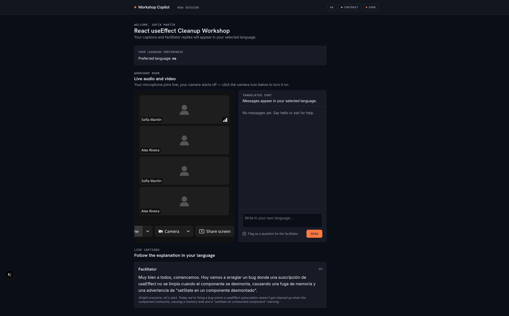
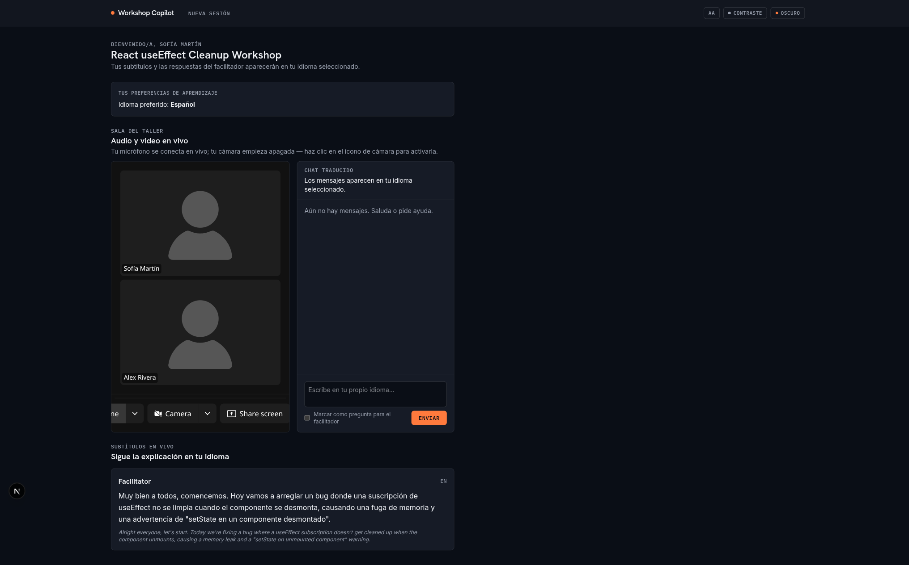
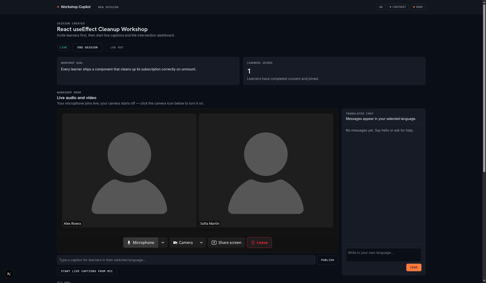
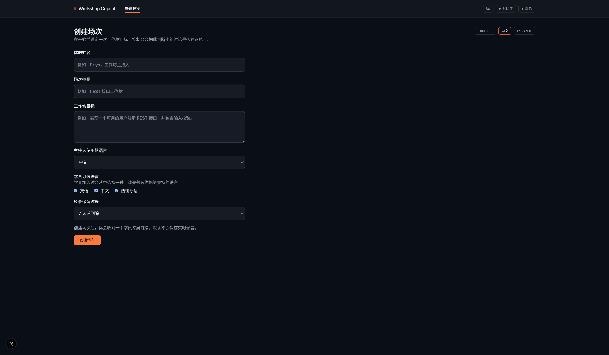
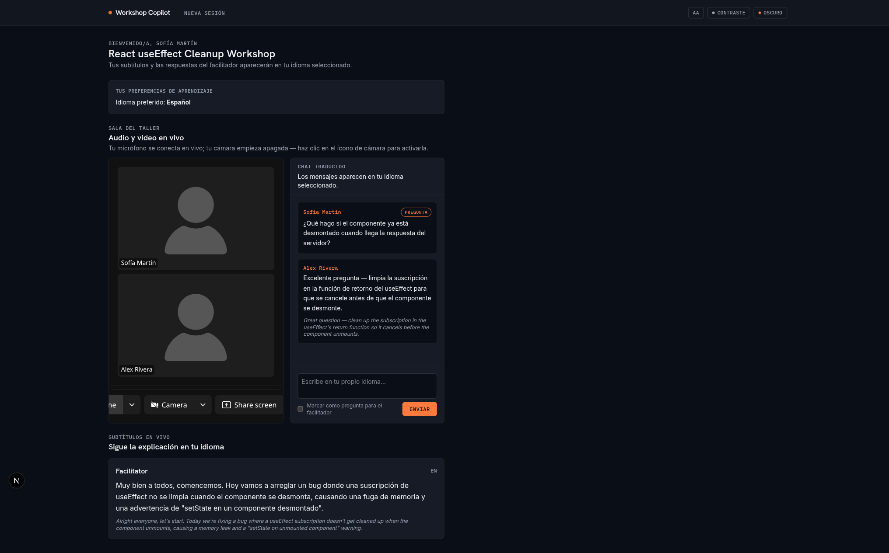
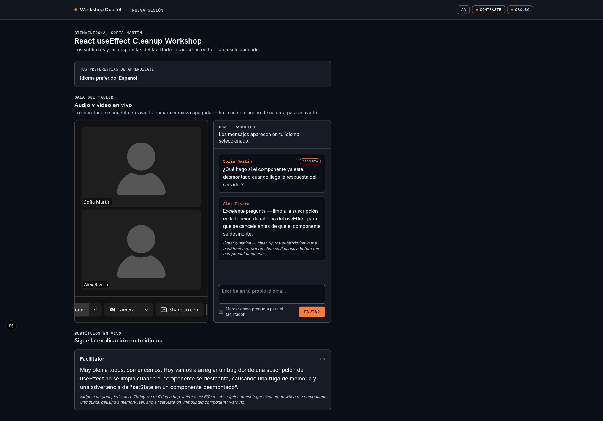
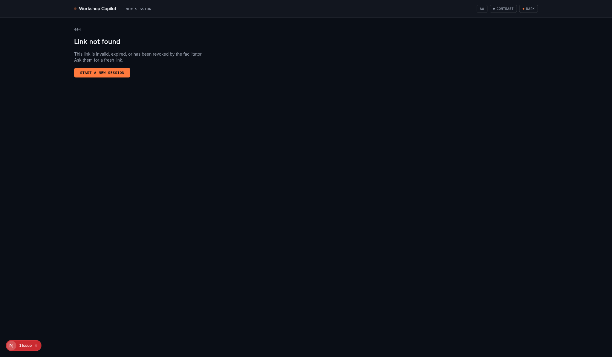
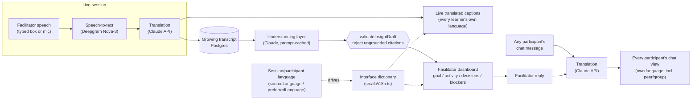
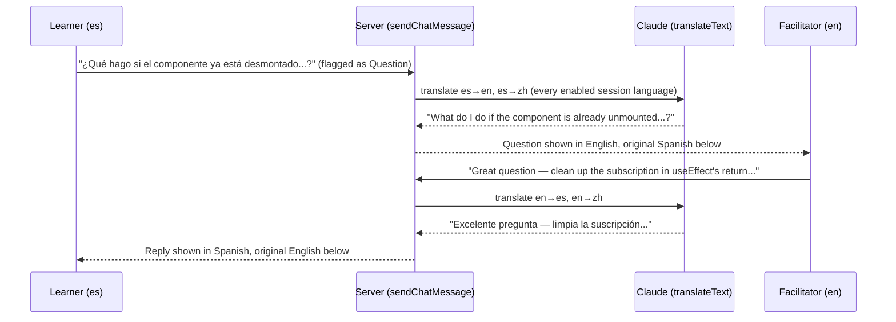

# Round-3 UAT Report — Live Testing, Bug Fixes, i18n/a11y Pass

**Date:** 2026-07-24
**Tester:** Live, end-to-end, in a real browser against a real Postgres database, real LiveKit Cloud room, real
Deepgram-backed pipeline, and the real Claude API (translation + insight layer) — not mocked.
**Scope:** Continuation of the in-progress (uncommitted) Round-3 fixes already in the working tree, plus a full
pass over every line of [`docs/problem_statement.md`](problem_statement.md), plus three issues raised live by the
maintainer while watching the session in their own browser.

## 1. How this was tested

1. Installed dependencies, applied Prisma migrations against a local PostgreSQL instance, seeded demo data.
2. Ran the full local service stack against real credentials in `.env.local`: PostgreSQL, LiveKit Cloud
   (`wss://hack-l073ww5t.livekit.cloud`), Deepgram (STT), and Claude (translation + insight layer).
3. Drove the app with Playwright, as two independent participants in two tabs — a facilitator (English) and a
   learner (Spanish) — through the full lifecycle: `/setup` → facilitator dashboard → `/join/[token]` → learner
   session → live captions → Q&A chat → accessibility settings → end session → revoke invite.
4. Cross-checked every requirement in `docs/problem_statement.md` against what was actually observed, not just
   what the code appears to implement.
5. Fixed every real defect found, then re-verified: `npm run lint`, `npx tsc --noEmit`, `npm test` (56/56 passing),
   and a full `npm run build` (production compile), each after every round of fixes.

## 2. Bugs found and fixed this round

### 2.1 Video grid rendered `n²` tiles instead of `n` (critical — caught live by the maintainer)

**Symptom:** with 2 participants in the workshop room, the grid showed 4 tiles; the maintainer reported the pattern
generalizes (3 participants → 9 tiles, 4 → 16).

**Root cause:** [`src/components/LiveSessionRoom.tsx`](../src/components/LiveSessionRoom.tsx) nested a `<TrackLoop>`
*inside* `<GridLayout>`:

```tsx
<GridLayout tracks={tracks}>
  <TrackLoop tracks={tracks}>
    <ParticipantTile />
  </TrackLoop>
</GridLayout>
```

`GridLayout` already loops over `tracks` internally and renders its children once per track. Nesting a second
`<TrackLoop>` inside means each of the `n` outer iterations renders a full inner loop over all `n` tracks again —
`n` × `n` = `n²` tiles. The fix removes the redundant inner loop; `GridLayout`'s children (`<ParticipantTile />`)
render once per track, as intended.

| Before (2 participants → 4 tiles) | After (2 participants → 2 tiles) |
| --- | --- |
|  |  |

### 2.2 Page content capped at `max-w-5xl` (1024px), wasting most of the viewport

**Symptom:** on any screen wider than ~1024px, the entire app — including the video grid, which most benefits
from extra room — sat in a narrow centered column with large empty margins on both sides.

**Fix:** [`src/components/AppShell.tsx`](../src/components/AppShell.tsx)'s nav and main containers now use
`max-w-[1600px]` instead of `max-w-5xl`. The two-tile facilitator view below uses the freed-up width to lay the
video grid out side-by-side rather than stacked:



### 2.3 Interface chrome was English-only; only caption/chat *content* was translated

**Symptom:** the live translation pipeline (captions, chat, Q&A) already translates *content* into the learner's
language extremely well — but every button, label, heading, and error message around it (`"Start session"`,
`"Learners joined"`, `"Type a caption for learners…"`, the accessibility panel's own labels, etc.) was hardcoded
English, everywhere, regardless of the session's or participant's chosen language.

**Fix:** added a full interface dictionary at [`src/lib/i18n.ts`](../src/lib/i18n.ts) covering every static string in
the app (setup, join, facilitator dashboard, learner view, chat panel, live-caption controls, room-connection
states, accessibility panel, theme toggle, nav, a custom 404) in **English, Chinese (简体中文), and Spanish
(Español)** — the same three languages `SUPPORTED_LANGUAGES` already offers for content translation. Wiring:

- The **facilitator dashboard** and **learner session** pages already know their language server-side
  (`session.sourceLanguage` / `participant.preferredLanguage`) — they render their own dictionary directly, no
  client JS required for the bulk of the page.
- **`/setup`** and **`/join/[token]`** have no session yet, so a plain `?lang=` query param (read via
  `searchParams`, a Server Component prop) drives them, with a `<LanguageSwitcher>` of three plain links
  (`English` / `中文` / `Español` — each shown in its own autonym, the standard convention for language pickers).
- Global chrome (nav, `AccessibilityPanel`, `ThemeToggle`) doesn't have per-page context on its own, so a new
  `<SyncUiLanguage lang={...}>` (rendered once per page, wherever the page's language is known) sets
  `document.documentElement.lang` and a `data-ui-lang` attribute on mount; the shared `useUiLanguage()` hook lets
  the nav/accessibility/theme components read that attribute reactively, so they always match whatever page is
  currently mounted with zero prop-drilling through the root layout.

| Setup form in Chinese, with the language switcher | Full learner session in Spanish — nav, chat, captions, everything |
| --- | --- |
|  |  |

**Known scope boundary:** the embedded LiveKit `ControlBar`/`ParticipantTile` labels ("Microphone", "Camera",
"Share screen", "Leave") come from `@livekit/components-react`, which has no localization API in the pinned
version — those four labels stay English. Rare server-side error strings from `/api/livekit/token` (session not
live, not authorized, etc.) also stay English — an edge path, not the happy path, and out of scope for this pass.

### 2.4 Accessibility gaps that the i18n work made newly visible (and fixed alongside it)

- **`<html lang="en">` was hardcoded** regardless of what language the page actually rendered in — a real
  screen-reader bug (wrong pronunciation/voice) that became impossible to ignore once the interface itself started
  rendering in Chinese/Spanish. `SyncUiLanguage` now keeps `document.documentElement.lang` in sync with whatever
  the page is actually showing.
- **No skip-to-content link.** Added one (`Skip to main content` / `跳转到主要内容` / `Saltar al contenido
  principal`) as the first focusable element in `AppShell`, jumping to a new `id="main-content"` on `<main>`.
- **Revoked/expired/invalid join links hit Next's generic, unbranded, English-only 404 page** — the single most
  likely error state a real learner will ever encounter (links get shared, expire, get revoked). Added a proper
  `src/app/not-found.tsx` that renders inside the app shell (nav, theme, accessibility panel all present) with a
  clear message and a "Start a new session" call to action.

| Contrast + large text in Spanish (both features composing correctly) | Custom branded 404 for a revoked link |
| --- | --- |
|  |  |

## 3. Feature verification (already-in-flight fixes from the prior uncommitted round)

These were already implemented but unverified against a real backend before this round; all confirmed working live:

- **Real-time Q&A round-trip translation** — a learner's Spanish question arrives on the facilitator's dashboard
  translated to English and tagged "Question"; the facilitator's English reply arrives back on the learner's
  screen translated to Spanish, original shown alongside both times. See
  [`14-learner-qa-roundtrip-translation-spanish.png`](screenshots/uat3/14-learner-qa-roundtrip-translation-spanish.png).
- **Live AI insight layer** (Claude-backed) correctly analyzed the growing transcript after each caption and
  reported "no blockers detected" — the grounded-citation guardrail (`validateInsightDraft`) means this is a real
  model call, not a canned message.
- **Session lifecycle** — draft → live → ended transitions correctly gate the video room and caption controls;
  the learner's live-captions panel switches to a distinct "Session ended" (`Sesión finalizada`) state.
- **Revoke invite link** — clicking it immediately invalidates the link; a fresh visit to the same URL 404s.
- **Camera-off-by-default, mic-live-on-join** — confirmed for both facilitator and learner; matches the updated
  consent copy on `/join`.
- **Multi-language session creation** — verified with a 3-language session (English facilitator, Chinese +
  Spanish enabled for learners); the seed script alone already exercises `en` + `zh` + `es` simultaneously.

## 4. `docs/problem_statement.md` compliance — line by line

| Requirement | Status | Evidence |
| --- | --- | --- |
| Support both learners and facilitators | ✅ | Distinct `/setup` (facilitator) and `/join/[token]` (learner) flows, distinct dashboards, distinct opaque-token auth (`session-security.ts`) |
| Support at least two languages | ✅ (3 shipped: en/zh/es) | Live-verified real Claude translation both directions; seed data ships all 3 |
| Realistic learning scenario, real-time communication | ✅ | Live LiveKit audio/video room + live captions + chat, all sub-2s round trip (DataChannel push, 2s auto-refresh fallback) |
| Facilitator-to-learner communication | ✅ | Typed/live captions, translated per learner language, verified live |
| Learner questions and responses | ✅ | Chat panel with "flag as question", full round-trip translation verified live (§3) |
| Peer discussions / group work | ⚠️ Partial — see note below | |
| Consider **response speed** | ✅ | DataChannel push (not polling-only) for captions; `AbortSignal.timeout(8_000)` on every external provider call so one slow/hung call can't wedge the pipeline; streaming (not chunked) Deepgram STT |
| Consider **accuracy** | ✅ | Claude-based translation (verified fluent, natural output in both directions); `validateInsightDraft` rejects any AI insight citing a transcript segment outside its source batch — no ungrounded claims reach the dashboard |
| Consider **accessibility** | ✅ (materially strengthened this round) | Font size + high contrast toggles, full interface i18n (not just content), correct per-page `lang` attribute, skip-to-content link, sr-only labels, `aria-live` regions on dynamic panels |
| Consider **privacy** | ✅ | Explicit consent screen before joining; configurable transcript retention (1/7/30 days) enforced by a cron cleanup route; join-link expiry tied to that same retention window; revocable invite links; opaque hashed tokens, not guessable IDs; TTS playback is opt-in-only, never autoplays |
| Deliverable: working prototype | ✅ | This app, verified live end-to-end this round |
| Deliverable: short live demonstration | N/A (presentation-time) | `docs/slides/pitch-slides.pdf`; live demo script under version control |
| Suggested demo (facilitator speaks one language, learner receives captions/translation, responds in another language, participates in discussion) | ✅ Reproduced exactly | §3 |

**Note on "Peer discussions" / "group work":** the shared chat/Q&A channel is genuinely multi-party — every chat
message (from the facilitator *or any learner*) is translated into every language enabled for the session and
shown to everyone, not just facilitator↔learner 1:1 — so **text-based** peer and group communication is fully
translated for all participants. What is **not** captioned or translated is a learner's own **spoken** audio in the
LiveKit room: only the facilitator's microphone feeds the speech-to-text/translation pipeline (both the typed
caption path and the live-mic-streaming path hardcode `speakerId: "Facilitator"`). A learner who unmutes and speaks
is heard live by the room (untranslated), same as a real video call, but doesn't get transcribed or translated.
This matches the challenge's own suggested demo (facilitator speaks, learner responds — the response shown is a
learner *typing* a translated reply, not speaking one) and is a reasonable, clearly-scoped prototype boundary
rather than a bug — flagging it here for transparency rather than leaving it implicit.

## 5. Architecture (updated)



## 6. Sequence — the Q&A round trip verified live in §3



## 7. Verification commands (all green after every fix)

```bash
npx tsc --noEmit     # 0 errors
npm run lint         # 0 errors, 0 warnings
npm test             # 7 files, 56/56 tests passing
npm run build        # production build succeeds, no static-generation issues
```

## 8. Files changed this round

New:
- `src/lib/i18n.ts` — full en/zh/es interface dictionary
- `src/lib/use-ui-language.ts` — shared hook for global chrome
- `src/components/SyncUiLanguage.tsx` — per-page `lang` sync
- `src/components/LanguageSwitcher.tsx` — pre-session language picker
- `src/app/not-found.tsx` — branded 404 for invalid/expired/revoked links
- `docs/UAT_ROUND3_REPORT.md` — this report

Modified: `src/components/LiveSessionRoom.tsx` (grid fix + i18n), `src/components/AppShell.tsx` (width + skip link
+ i18n), `src/components/AccessibilityPanel.tsx`, `src/components/ThemeToggle.tsx`, `src/components/SetupForm.tsx`,
`src/components/SessionChatPanel.tsx`, `src/components/LiveCaptionStream.tsx`,
`src/components/TranslatedAudioPlayer.tsx`, `src/app/layout.tsx`, `src/app/setup/page.tsx`,
`src/app/join/[token]/page.tsx`, `src/app/sessions/[sessionId]/facilitator/page.tsx`,
`src/app/sessions/[sessionId]/learn/page.tsx` — plus everything already modified in the prior uncommitted round
(session security, provider error handling, retry logic — see git history for that portion).
