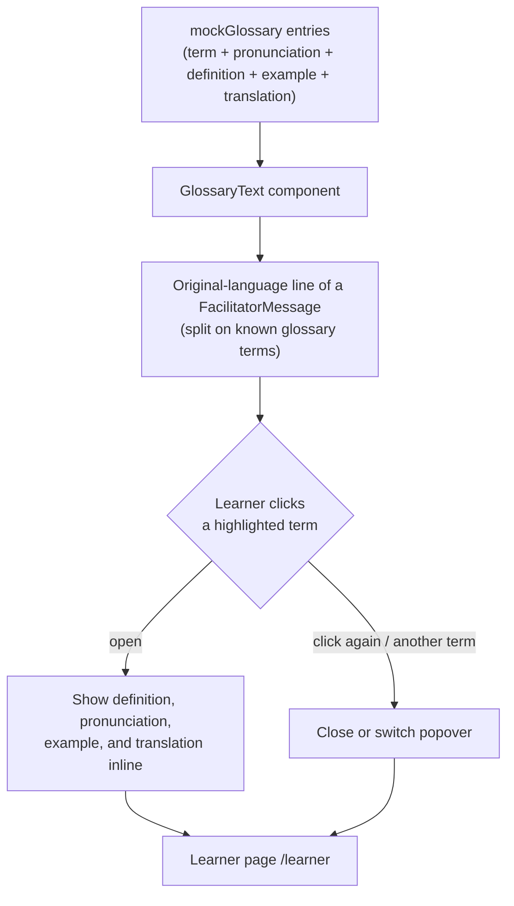

# AI Glossary

Implements the **AI Glossary** feature from `FEATURE_LIST.md` (Module 1 — Understand) as a mocked, frontend-only flow on the learner page.

## Flow

## Notes

- `mockGlossary` is precomputed mock data (`src/lib/mock-data.ts`), not a live term-extraction call — consistent with the rest of the prototype (live captions, confidence, simplify explanation are all mocked).
- `GlossaryText` (`src/components/GlossaryText.tsx`) splits a line of text on known glossary terms and renders each match as a clickable, underlined term; clicking opens an inline card (reusing `Card`) with the term's pronunciation, definition, example, and translation — no page navigation required.
- Popover open/close state is local to each `GlossaryText` instance, so only one term's card is open per message at a time.
- Wired into `FacilitatorMessage` on the learner view, over the original-language line, since that's where an unfamiliar technical term is most likely to appear untranslated.
- Screenshots: `docs/screenshots/ai-glossary-before.png`, `docs/screenshots/ai-glossary-after.png` (after shows the `validateEmail()` term's glossary card open).
