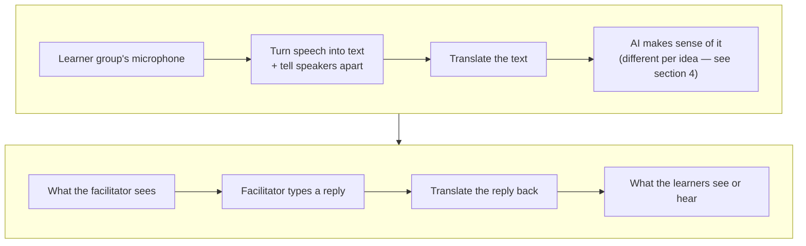
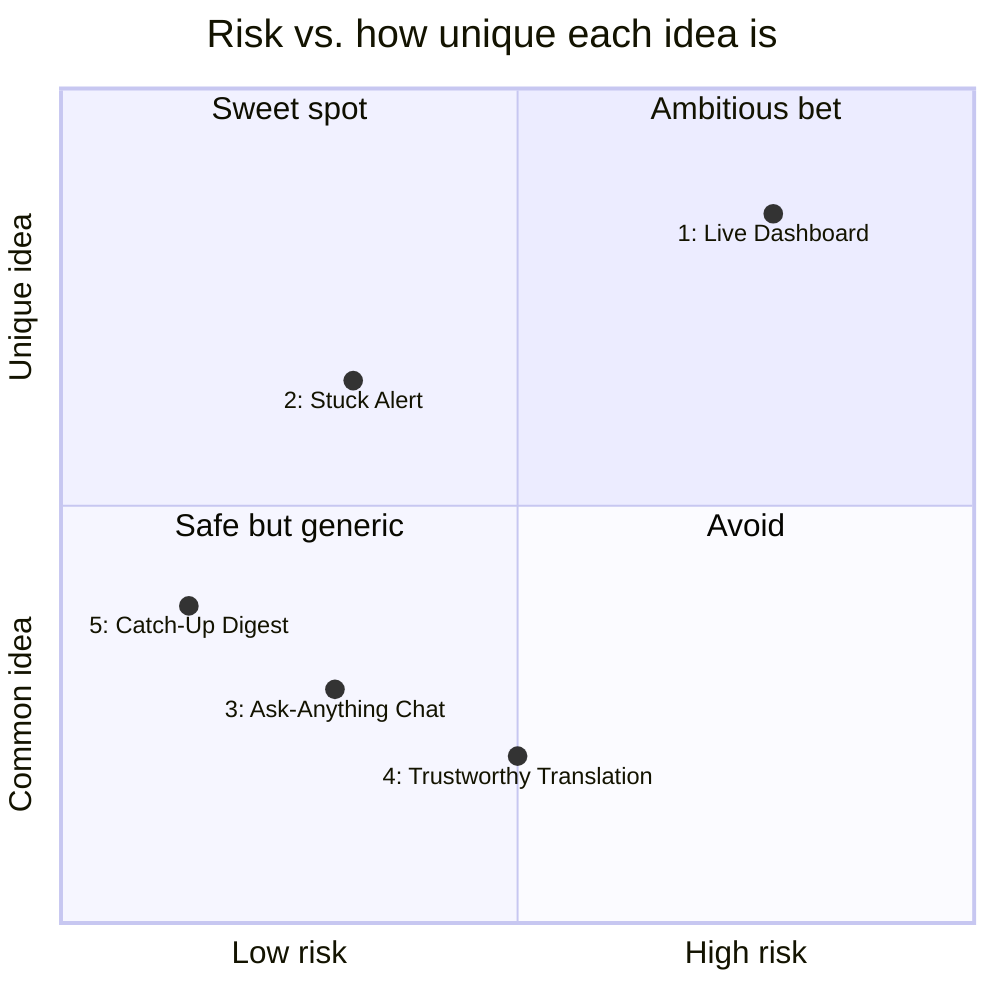
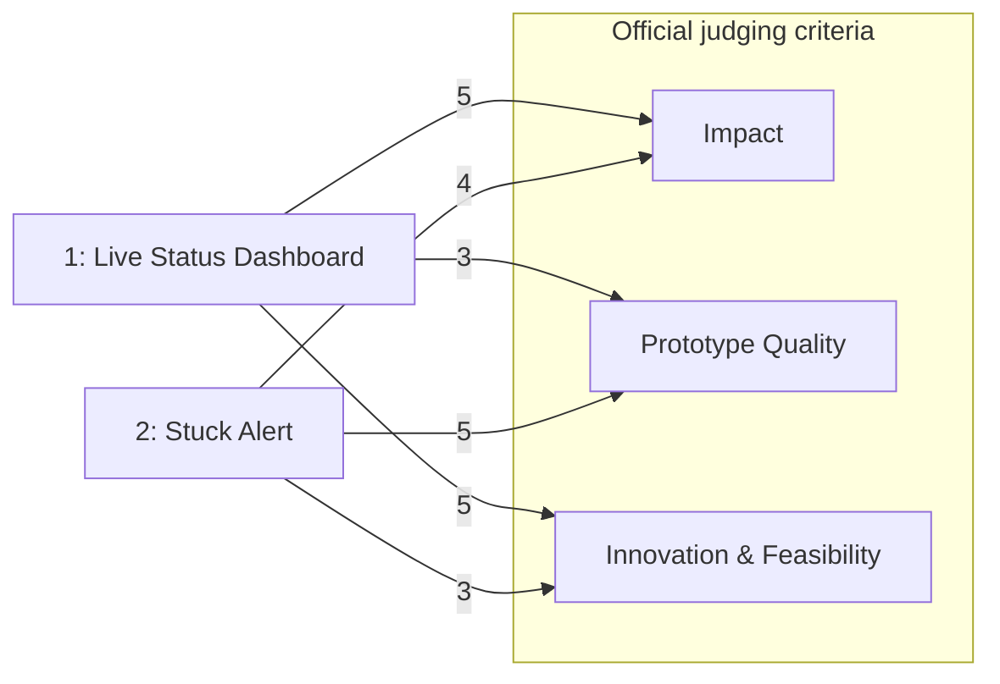
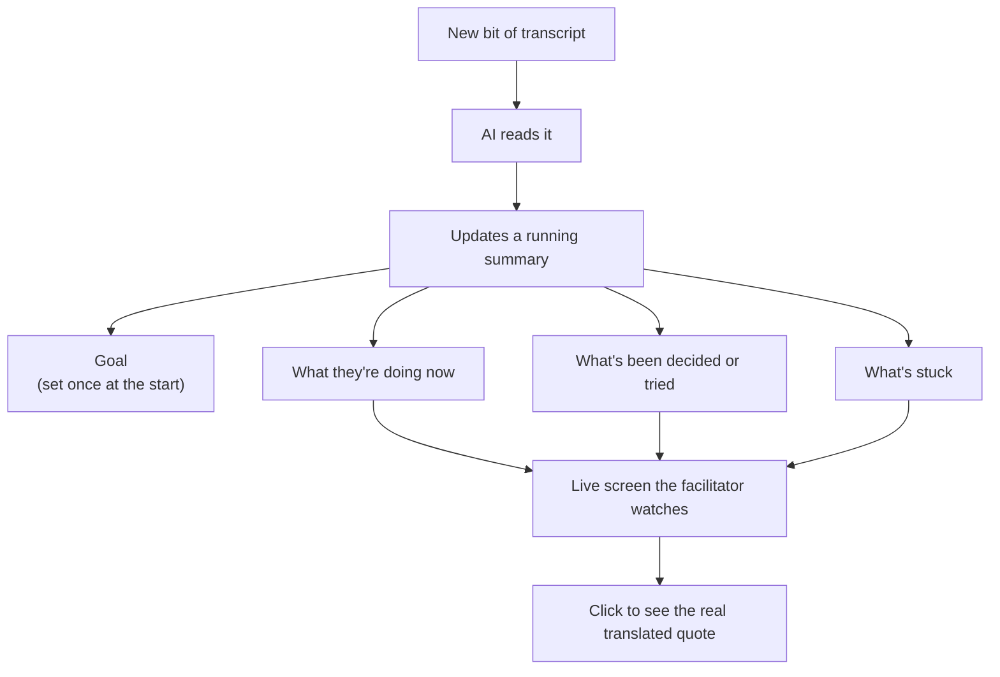
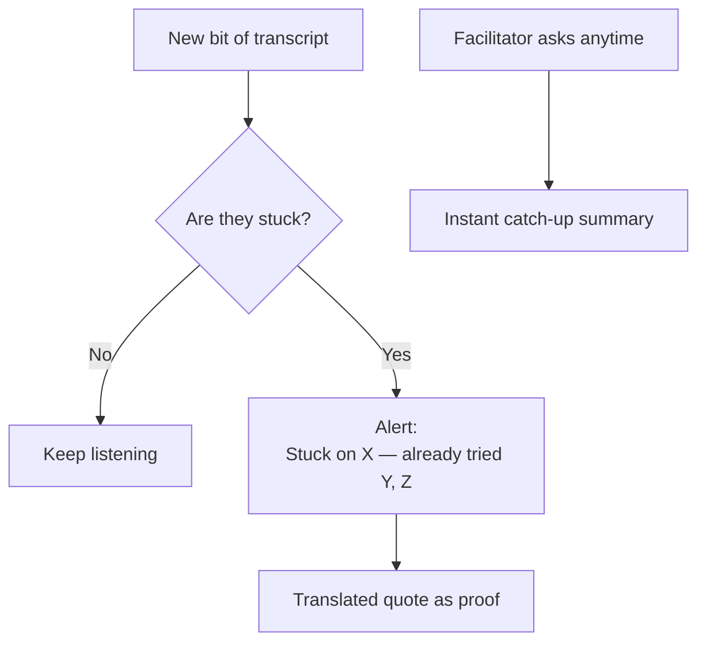
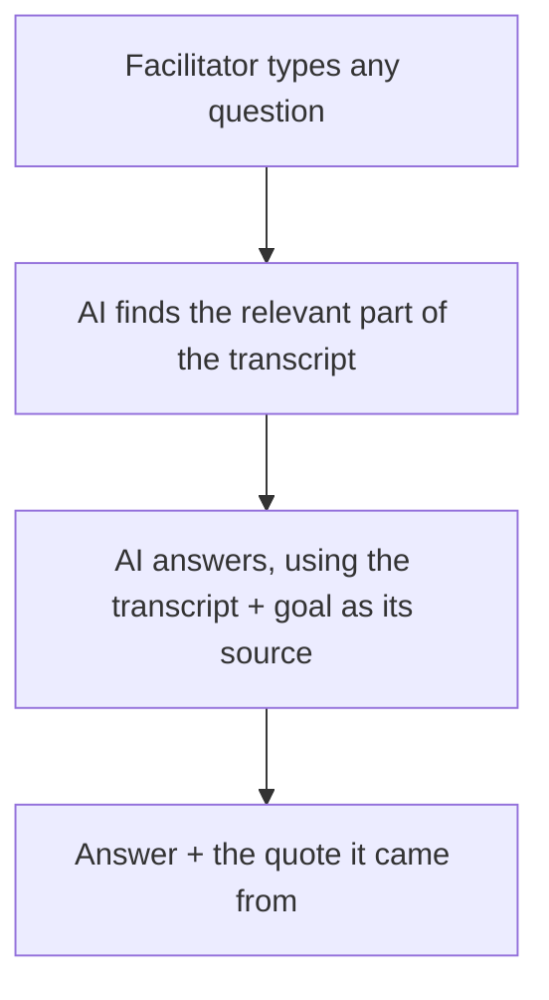
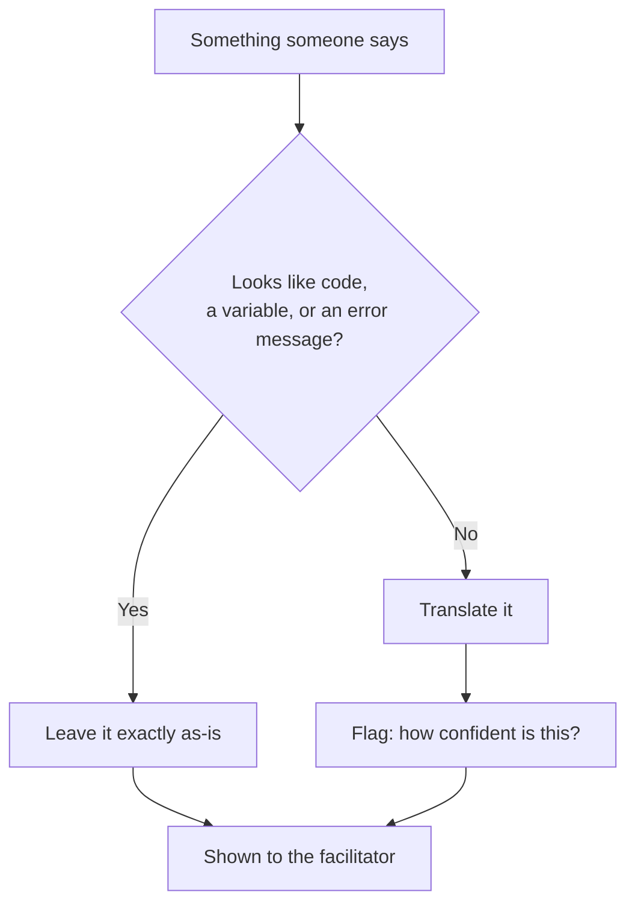
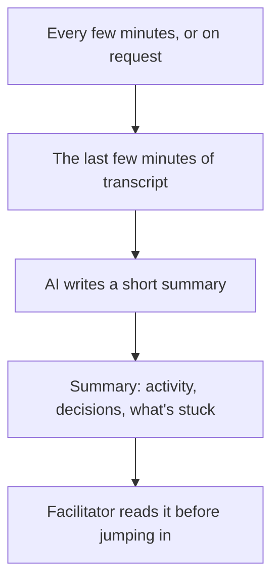
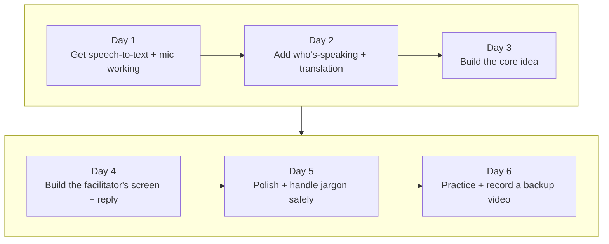
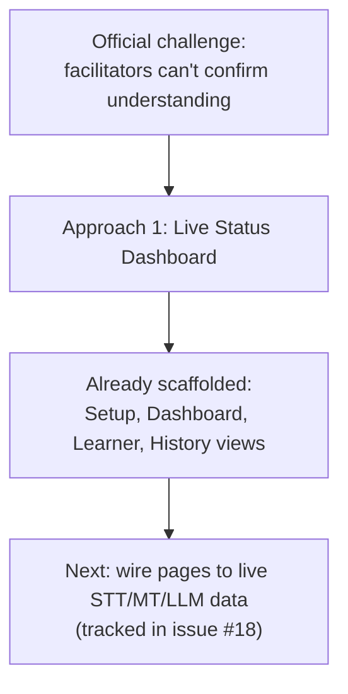

# Cross-Lingual Remote Workshop Facilitation — Brainstorm & Validation

This builds on `problem_statement.md`. What we've already decided: a full-stack + AI-APIs team, a standalone web app (not a Zoom/Teams plug-in), one language pair for the demo, live microphone capture in the browser, a team of 5+, and a demo built around a technical/coding exercise.

**Quick glossary (plain English, so the rest of this doc reads easily):**

- **STT** = speech-to-text: turning spoken audio into written words.
- **Diarization** = figuring out *who* is talking, so the transcript can be split by speaker.
- **MT** = machine translation: software translating text or speech automatically.
- **LLM** = large language model: the AI (like Claude or GPT) that reads text and writes answers or summaries.
- **RAG** = "retrieval-augmented generation": instead of expecting an AI to remember everything, it looks up the relevant bit of text first, then answers based on that.
- **CSCW / HCI** = academic research fields that study how people collaborate and how they use technology — cited below as evidence.
- **Prompt caching** = a trick that makes repeated AI calls over the same growing text (like a live transcript) much cheaper.
- **White space** = a genuine gap in the market — something nobody has built yet.

---

## 1. Validation findings (plain-English summary)

**Is anyone already doing this? No — it's a real gap.** We checked every major "translate a meeting live" product: Wordly, KUDO AI, Interprefy, Microsoft Teams, Google Meet, Zoom AI Companion, DeepL Voice, Palabra.ai, JotMe, and Meta's Seamless models. They all translate speech well, and most now also generate a summary — but only **after** the call ends, and only a generic one. None of them know the workshop's goal, none notice in real time when a group is stuck, and none remember what a group has already tried. Separately, the tools that *do* track "what's blocking us" live (Fellow, Fireflies, Read.ai) only work in one language, and openly admit they're unreliable for multilingual meetings. **Nobody has combined "translate it live" with "actually understand what's happening" — that gap is real.**

**Do we know people actually want this? Not directly — but the underlying problem is real.** We searched Reddit, Hacker News, review sites, and translator communities for people literally describing "I joined a workshop late, in another language, and had no idea what was going on." We found nobody saying that in those exact words. What we *did* find:

- A university study ([Zhang et al. 2022](https://arxiv.org/abs/2209.02906)) tested this directly: when people received a translated summary of what a subgroup had discussed *before* joining a shared meeting, the meeting genuinely went better. That's close to proof that translated context — not just translated words — actually helps.
- Quotes from non-native speakers in a research survey: *"It's always hard to take notes of everything that happens in the meeting."* — real evidence that people struggle to keep up with fast multilingual discussion live.
- Zoom, Google Meet, and Cisco already sell a "catch me up if I joined late" feature — proof people will pay for exactly this kind of help, just not yet across multiple languages at once.

**Bottom line:** this is a smart, well-supported guess about a real problem — not yet a "we asked 50 facilitators and they all said yes." If your team has even an hour spare, talking to 2-3 real people who've run multilingual training would be the single best use of that hour before you lock your demo script.

**What's already been tried** (so you don't accidentally re-build something that already exists or already failed):

- **LINC** — the closest research project we found: a live multilingual meeting tool plus a summary dashboard. Its own authors pulled the paper back to revise it, so even the closest attempt isn't a finished, proven success yet.
- **A Microsoft patent** already describes detecting a latecomer and generating a "what happened before you joined" summary — but only in one language.
- **AWS's "Live Meeting Assistant"** — a free, open-source example combining speech-to-text, AI, and translation, built around the same "catch up a latecomer" idea. Not aimed at workshops specifically.
- Two research studies on AI meeting-facilitator "bots" found people tend to dismiss critical feedback from an AI, and in another study, AI language help sometimes made things *worse* — it distorted how confident people looked to each other, instead of leveling the playing field.

**What to actually build it with (2026 options):**

- **Turning speech into text, and telling speakers apart:** Deepgram Nova-3 — cheapest and fastest option (about $0.55/hour, handles multiple speakers). AssemblyAI is a solid backup.
- **Translating the text:** DeepL's API — free for a generous amount of demo-scale use, and very accurate for the languages it covers. Fall back to Google Translate or an open model called NLLB for languages DeepL doesn't support.
- **Making sense of the transcript (summarizing, tracking what's happening):** Claude, fed chunks of the growing transcript every so often. Prompt caching (see glossary) makes repeatedly re-reading a growing transcript cheap.
- **Avoid** all-in-one "talk to the AI and it talks back" voice products (OpenAI's Realtime API, Google's Gemini Live) as your main architecture — great for one person talking to an AI, weaker at telling multiple speakers apart, and harder to debug when something's wrong, since you can't easily tell whether the transcription, the translation, or the summary is the broken part.

**Risks to keep in mind, no matter which idea you build:**

1. **Translation gets worse on technical language** — true in studies from 2006 and still true in 2026. Your demo is a coding exercise full of function names, variables, and error messages, so this will bite you if you don't design around it.
2. **An AI that's confidently wrong is worse than no AI at all.** If your tool tells a facilitator "they're stuck on X" and it's wrong, that actively hurts more than it helps. Always show the real (translated) quote behind any claim — don't just assert it.
3. **People don't fully trust AI note-takers yet, even mature ones** — plenty of people still write their own meeting notes by hand despite having good AI tools available.
4. **Don't try to track everything.** "Goal, current step, decisions made, advice already given" is a lot to model correctly in 6 days — pick less, and do it well.

---

## 2. Shared pipeline at a glance

Every idea below is built on the same basic pipeline: turn speech into text, translate it, then have an AI make sense of it. What changes between ideas is just that last step — what the AI does with the text, and what the facilitator sees.

---

## 3. Comparison snapshot

| # | Idea | Core bet | Does it fill the gap we found? | How hard to build in 6 days | Demo "wow" | Best if... |
|---|---|---|---|---|---|---|
| 1 | Live Status Dashboard | A dashboard that keeps tracking the session live | Directly — this *is* the gap | Hard (designing + reliably updating the tracker) | High | You want the strongest, most defensible pitch |
| 2 | Stuck Alert | One clear alert, not a full dashboard | Partly — covers the highest-value moment | Easy | Medium-high (one great moment) | You want reliability over ambition |
| 3 | Ask-Anything Chat | A chat box that answers questions about the discussion | Weakly — flexible but generic | Easy-medium | Medium (reads as "a chatbot") | You want maximum flexibility, least risk of a broken tracker |
| 4 | Trustworthy Translation | Make the translation itself rock-solid, especially for jargon | Indirectly — fixes translation trust, not the "what's happening" gap | Easy-medium | Medium (subtle, easy to underrate live) | Judges/users care more about trust in the words than the dashboard |
| 5 | Catch-Up Digest | A short summary every few minutes, not a live dashboard | Partly — matches the "catch me up" feature others already sell | Easy | Medium | You want to avoid tricky real-time engineering entirely |

---

## 3b. Scored against the official judging criteria

This section was added after the organizers issued the official "Breaking Language Barriers" challenge text (see `problem_statement.md`). The table above used our own ad-hoc columns; here each approach is scored 1-5 directly against the three **official judging criteria** and checked against the **four official minimum requirements** (2+ languages, supports both learners and facilitators, realistic real-time demo, and response speed/accuracy/accessibility/privacy).

| # | Idea | Impact | Prototype Quality | Innovation & Feasibility | Privacy/accessibility notes |
|---|---|---|---|---|---|
| 1 | Live Status Dashboard | 5 — directly targets "facilitators struggle to confirm understanding," the core pain point named in the challenge | 3 — hardest to keep reliable, but highest payoff if it works | 5 — the one combination nobody else ships, per our research | Quote-grounded claims aid accessibility (screen-readable evidence); no extra privacy exposure beyond STT/MT already required |
| 2 | Stuck Alert | 4 — hits the single highest-value moment named in the challenge ("learners hesitate to speak / miss instructions") | 5 — small surface area, easy to keep reliable for a live demo | 3 — narrower slice of the gap than the full dashboard | Same privacy footprint as #1, smaller UI so easier to keep accessible |
| 3 | Ask-Anything Chat | 3 — flexible, but doesn't proactively surface understanding gaps the way the challenge emphasizes | 4 — simple to build reliably | 2 — closest to existing "chat with your meeting" products, weakest on innovation | Neutral — same data as #1/#2, but request/response latency risks the "response speed" requirement |
| 4 | Trustworthy Translation | 3 — improves accuracy/trust, one of the four required qualities, but doesn't itself close the "confirm understanding" gap | 4 — narrow, well-defined scope | 3 — solid but a smaller bet, best paired with another approach | Directly satisfies the official "accuracy" requirement; no privacy change |
| 5 | Catch-Up Digest | 3 — helps latecomers, a secondary scenario vs. the challenge's live-discussion focus | 5 — lowest engineering risk | 2 — matches features Zoom/Google/Microsoft already ship | Lowest real-time load, easiest to keep responsive |

**All five approaches satisfy the two structural minimum requirements** (2+ languages via DeepL; both learner and facilitator views) — the table above focuses on where they differ: Impact, Prototype Quality, Innovation & Feasibility, and the accuracy/accessibility/privacy qualities the challenge calls out.

---

## 4. The five ideas

### Approach 1 — Live Status Dashboard
*(originally called "Grounded State-Panel Copilot")*

The facilitator tells the tool the workshop's goal once, at the very start. From then on, instead of a scrolling wall of translated text, the facilitator sees a simple live dashboard with four boxes: the **Goal** (set once), **What they're doing right now**, **What's been decided or tried**, and **What's stuck**. An AI reads the transcript as it comes in and keeps these four boxes updated. Every entry links back to the actual translated quote it came from, so the facilitator can double-check the AI instead of trusting it blindly. The facilitator can type a reply, which gets translated and optionally checked against the stated goal to catch contradictions.

*Why this one:* it's the exact combination nobody else has built, based on our research — the strongest pitch, but also the hardest to get right. The tricky part is keeping the dashboard accurate over time, without the AI forgetting earlier facts or making things up.

### Approach 2 — Stuck Alert
*(originally called "Blocker-Alert / Stuck Detector")*

No dashboard. Instead, an AI constantly listens and only speaks up when it notices the group is stuck: a card pops up saying something like "Stuck on X — already tried Y and Z," backed by the actual translated quote. The facilitator can also ask "catch me up" at any moment and get an instant summary (this is the same idea Microsoft and AWS already ship, just focused specifically on blockers). Much less to build — one thing that watches for "are they stuck," one thing that summarizes on request. No need to keep a big, evolving picture consistent over a long session.

*Why this one:* less can quietly go wrong, since there's no big running dashboard that could slowly drift into being wrong. All your effort goes into making one moment — the "they're stuck" alert — work perfectly for the demo.

### Approach 3 — Ask-Anything Chat
*(originally called "Facilitator Co-Pilot Chat", RAG-style)*

A simple chat box next to the video call. The facilitator types any question — "what have they tried?", "are they stuck?", "summarize the last 5 minutes" — and an AI answers by searching the transcript and the stated goal for the relevant parts. There's no fixed structure to design in advance; the AI figures out the answer fresh, each time it's asked.

*Why this one:* the safest to build, since there's no complicated tracker that could break, and it's the most flexible if judges ask unexpected questions. Downside: in a live demo it can look like "just a chatbot," a weaker pitch, and waiting for an answer to each question is riskier on stage than a dashboard that's already updated.

### Approach 4 — Trustworthy Translation
*(originally called "Translation-Quality-First Relay", Code-Aware Guard)*

Instead of betting on a smart dashboard, bet on making the translation itself trustworthy for a technical audience. The key idea: automatically detect anything that looks like code, a variable name, a command, or an error message, and leave it completely untouched instead of (mis)translating it — only the surrounding conversation gets translated. Add a short list of workshop-specific terms so they're translated consistently every time. Optionally show a "how confident is this translation?" flag so the facilitator knows when to double-check.

*Why this one:* it directly fixes a real, well-documented weak spot — translation quality falls apart on technical language, and your demo is a coding exercise full of exactly that. A less flashy pitch than "smart AI dashboard," but an honest fix for a real problem, and cheap to add underneath any of the other four ideas.

### Approach 5 — Catch-Up Digest
*(originally called "Handoff-Digest / Checkpoint Snapshot")*

Instead of tracking everything live, the AI writes a short summary every few minutes (or whenever asked): what the group's been doing, what they've decided, and what's currently blocking them — translated, and backed by quotes. A facilitator about to join a group (or who just did) reads the latest summary first, instead of watching a dashboard update in real time. This is the same "catch me up" idea Microsoft, Zoom, and Google already sell — just applied across languages and focused on blockers.

*Why this one:* much lower engineering risk — no need for instant, moment-to-moment updates, and no tracker that can drift out of sync, since each summary is just a fresh, one-off AI call over a short recent chunk of transcript. Best pick if your team wants to spend less time on tricky real-time engineering and more time polishing the demo.

---

## 5. Things to keep in mind no matter which idea you pick

- **Show your work, don't just assert it.** Every AI claim (a blocker, a decision, what's happening) should come with a visible, translated quote as proof — this directly protects against the AI confidently telling the facilitator something that's wrong.
- **The "leave code/jargon untouched" trick** (from Approach 4) is cheap to add on top of any of the other four ideas, and directly fixes the technical-jargon problem for your specific coding-workshop demo — treat it as a near-mandatory add-on, not just an alternative idea.
- **Quick real-world sanity check.** Since we couldn't find direct proof people are already asking for this, a 15-minute chat with 2-3 people who've actually run multilingual remote training would be the single best use of an hour outside of coding.
- **Have a backup plan for demo day.** Whichever idea you build, record a backup video in advance in case live microphone capture fails on stage.

**Typical 6-day build shape** (the first two days are shared no matter which idea you pick; days 3-4 depend on your choice):

---

## 5b. Decision confirmed: Approach 1

**Approach 1 (Live Status Dashboard) is the direction that's been built.** It scores highest on both Impact and Innovation & Feasibility above, and is the only one of the five that directly closes the gap the official challenge names: *"Facilitators may also find it difficult to confirm whether participants have understood the discussion."* The frontend already implements its four building blocks — Goal, current Activity, Decisions, and Blockers — each grounded in a translated quote, matching the "response speed, accuracy, accessibility, and privacy" requirement from the official text.

| Setup | Facilitator Dashboard |
|---|---|
|  |  |

| Learner View | Session History |
|---|---|
|  |  |

Approach 4's "leave code/jargon untouched" translation guard remains a recommended add-on for the coding-workshop demo, layered on top of Approach 1 rather than built standalone.

---

## 6. Full source list

These are the sources behind every claim above — useful if you want to double-check something or dig deeper.

- Wordly: [Live Translation](https://www.wordly.ai/live-translation), [AI Summaries](https://www.wordly.ai/ai-summaries), [Workspaces](https://www.wordly.ai/workspaces)
- KUDO AI: [homepage](https://kudo.ai/), [2026 year in review](https://kudo.ai/blog/kudo-year-in-review-global-multilingual-communication/)
- Interprefy: [homepage](https://www.interprefy.com/), [AI translation solutions](https://www.interprefy.com/solutions/ai-translation)
- Microsoft Teams: [live captions](https://support.microsoft.com/en-us/teams/meetings/use-live-captions-in-microsoft-teams-meetings), [multilingual speech recognition](https://support.microsoft.com/en-us/office/multilingual-speech-recognition-in-microsoft-teams-650cb6d2-8a33-40e7-840d-36bb90216aa4)
- Google Meet: [translated captions](https://support.google.com/meet/answer/10964115), [translation guide](https://maestra.ai/blogs/google-meet-real-time-speech-translation), [Gemini 3.5 Live Translate](https://blog.google/innovation-and-ai/models-and-research/gemini-models/gemini-live-3-5-translate/)
- Zoom AI Companion: [accessibility features](https://www.zoom.com/en/products/ai-assistant/features/accessibility/), [transcript translation 2026](https://www.bluente.com/blog/zoom-ai-companion-transcript-translation-2026)
- Otter.ai: [homepage](https://otter.ai/), [review 2026](https://www.spinach.ai/blog/otter-ai-review)
- DeepL: [Voice for Meetings](https://www.deepl.com/en/products/voice/deepl-voice-for-meetings), [Voice-to-Voice announcement](https://www.deepl.com/en/blog/voice-to-voice-translation-is-here), [API pricing](https://neuraplus-ai.github.io/blog/deepl-api-pricing-and-features-for-developers.html)
- Meta Seamless: [research page](https://ai.meta.com/research/seamless-communication/), [GitHub](https://github.com/facebookresearch/seamless_communication)
- Palabra.ai: [meetings translation](https://www.palabra.ai/solutions/online-meetings-translation) · JotMe: [homepage](https://www.jotme.io/) · Boostlingo: [live translation](https://boostlingo.com/solutions/multilingual-events/live-translation/)
- Fireflies/Read.ai/Fellow: [comparison](https://fireflies.ai/blog/fireflies-vs-read-ai/), [action item tracking](https://fellow.ai/blog/how-to-manage-meeting-tasks-and-action-items/)
- Academic: [Zhang et al. 2022, "Facilitating Global Team Meetings"](https://arxiv.org/abs/2209.02906), [LINC preprint](https://arxiv.org/pdf/2504.18988), [CLARA](https://dl.acm.org/doi/10.1145/3786325), [Observe, Ask, Intervene (CHI 2025)](https://arxiv.org/pdf/2501.10553), [(Dis)placed Contributions](https://dl.acm.org/doi/10.1145/3686942), [Sustaining Human Agency (CHI 2025)](https://arxiv.org/pdf/2503.07970), [Effects of MT on Collaborative Work (CSCW 2006)](https://dl.acm.org/doi/10.1145/1180875.1180955), [Re-FRAME Meeting Summarization](https://arxiv.org/pdf/2509.15901)
- Prior art: [Microsoft patent US 12406668](https://image-ppubs.uspto.gov/dirsearch-public/print/downloadPdf/12406668), [AWS Live Meeting Assistant (GitHub)](https://github.com/aws-samples/amazon-transcribe-live-meeting-assistant)
- Tech feasibility: [Deepgram Nova-3 pricing](https://brasstranscripts.com/blog/deepgram-pricing-per-minute-2025-real-time-vs-batch), [AssemblyAI pricing](https://www.assemblyai.com/pricing), [Azure real-time diarization](https://learn.microsoft.com/en-us/azure/ai-services/speech-service/get-started-stt-diarization), [OpenAI Realtime API](https://openai.com/index/introducing-gpt-realtime/), [Gemini Live API](https://ai.google.dev/gemini-api/docs/live-api), [faster-whisper](https://github.com/SYSTRAN/faster-whisper)
