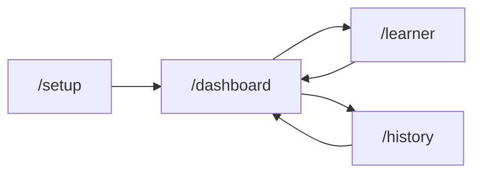
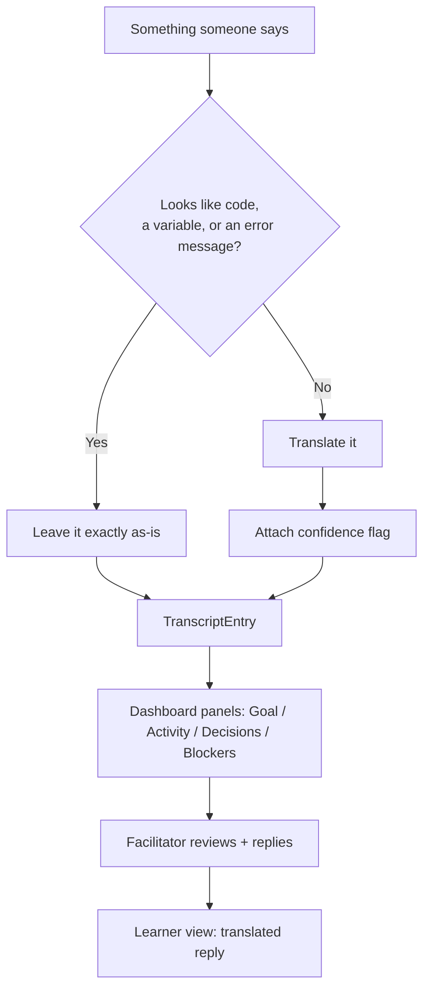

# Frontend Scaffolding Diagrams

## Page navigation

```mermaid
flowchart LR
  Setup["/setup"] --> Dashboard["/dashboard"]
  Dashboard --> Learner["/learner"]
  Dashboard --> History["/history"]
  Learner --> Dashboard
  History --> Dashboard
```

## Combined-approach data flow (mock-data scaffolding stage)

```mermaid
flowchart TD
  U[Something someone says] --> DET{Looks like code,<br/>a variable, or an error message?}
  DET -->|Yes| PASS[Leave it exactly as-is]
  DET -->|No| TR[Translate it]
  PASS --> ENTRY[TranscriptEntry]
  TR --> CONF[Attach confidence flag]
  CONF --> ENTRY
  ENTRY --> PANEL[Dashboard panels: Goal / Activity / Decisions / Blockers]
  PANEL --> FAC[Facilitator reviews + replies]
  FAC --> LEARNER[Learner view: translated reply]
```
