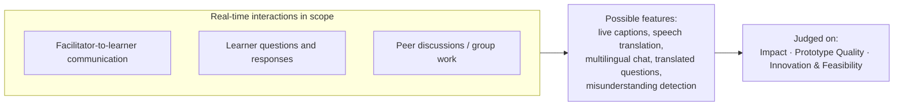
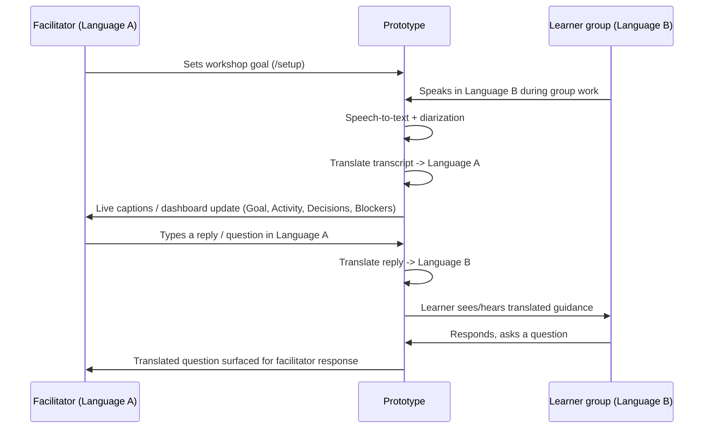

# Cross-Lingual Remote Workshop Facilitation

## Official Challenge Statement — "Breaking Language Barriers"

> Online and hybrid learning depend heavily on real-time communication through audio calls, video calls, chat, and collaborative group activities. Learners and facilitators may have different levels of language proficiency. These differences can lead to misunderstandings, reduced participation, slower discussions, and difficulty completing group work. Learners may hesitate to speak, miss important instructions, or struggle to express their ideas. Facilitators may also find it difficult to confirm whether participants have understood the discussion.

**Challenge:** Design and build a working prototype that helps learners and facilitators communicate more clearly across language differences during real-time online or hybrid learning sessions. The solution should improve communication during live interactions, including facilitator-led discussions, question-and-answer sessions, peer conversations, and group work.

**The prototype must:**

- Support both learners and facilitators
- Support at least two languages
- Be demonstrated in a realistic learning scenario with real-time communication
- Consider response speed, accuracy, accessibility, and privacy

**Judging criteria:**

- **Impact** — improves understanding, participation, or collaboration
- **Prototype Quality** — works reliably and is easy to use
- **Innovation and Feasibility** — original, practical, and suitable for real learning environments

Our project targets the **facilitator-to-learner** and **learner questions and responses** interactions first, using a remote-facilitator-and-local-group workshop as the realistic learning scenario for the demo.

## Mapping to the Official Minimum Requirements

| Official requirement | How this project satisfies it |
|---|---|
| Support both learners and facilitators | Separate `/learner` and `/dashboard` views (facilitator) fed by the same session, plus a shared `/setup` flow |
| Support at least two languages | Demo runs one facilitator language ↔ one learner-group language via DeepL, architected to add language pairs |
| Realistic learning scenario, real-time communication | Demo scenario: a facilitator supporting a live hands-on coding workshop, joining a learner group mid-session |
| Response speed, accuracy, accessibility, privacy | Streaming STT/translation for speed; quote-grounded AI claims for accuracy; captions/translated text for accessibility; no recordings persisted beyond the session (see Out of Scope) |

## Suggested Demo Flow

## Prototype Screenshots

| Setup | Facilitator Dashboard |
|---|---|
|  |  |

| Learner View | Session History |
|---|---|
|  |  |
