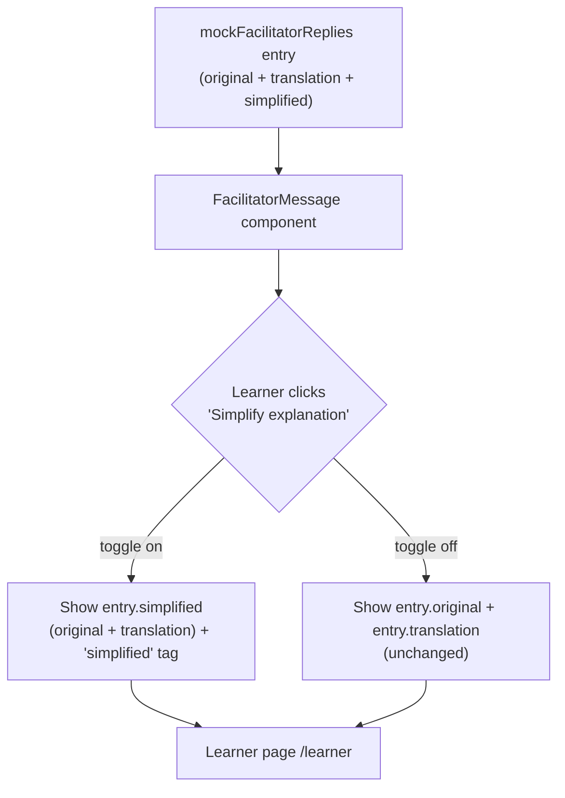

# Simplify Explanation

Implements the **Simplify Explanation** feature from `FEATURE_LIST.md` (Module 1 — Understand) as a mocked, frontend-only flow on the learner page.

## Flow

## Notes

- `simplified` is precomputed mock data on `TranscriptEntry` (`src/lib/mock-data.ts`), not a live AI call — consistent with the rest of the prototype (live captions, confidence, transcripts are all mocked).
- Toggle state is local to each `FacilitatorMessage` instance; no global state needed.
- Screenshots: `docs/screenshots/simplify-explanation-before.png`, `docs/screenshots/simplify-explanation-after.png`.
