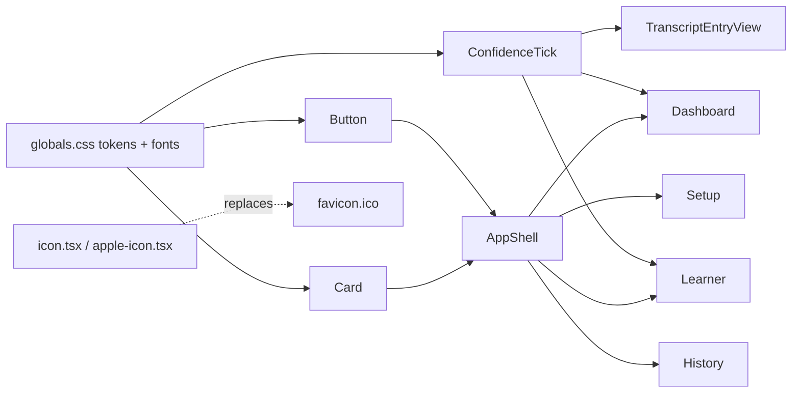

# UI/UX Redesign v2 — "Interpreter Console" — Design Spec

## Context

The v1 redesign (`docs/superpowers/specs/2026-07-23-ui-redesign-design.md`, issue #19, PRs #11-15)
aimed for a "calm data-dashboard" feel modeled on Linear/Vercel-dashboard tone. In practice the
shared primitives it introduced (`Card`, `Button`, `ConfidenceBadge`) were never adopted by the
actual pages — every page still renders its own ad hoc `border-black/10` / `zinc-500` /
`emerald-100` Tailwind strings (see `DashboardPanel.tsx`, `SummaryCard.tsx`, `SetupForm.tsx`,
`QuestionBox.tsx`, `ReplyBox.tsx`, and the pages that import them). The live result
(`docs/screenshots/*.png`) reads as generic, unstyled Tailwind-default SaaS: pure white cards,
zinc grays, a system font stack, rounded-full black buttons — exactly the "cookie-cutter Tailwind"
look this round is meant to replace.

Market research (five parallel research passes — live-interpretation platforms, AI meeting
copilots, workshop-engagement tools, broadcast/captioning UI, and confidence-visualization
patterns; full findings in this session's transcript) surfaced three candidate directions.
**Interpreter Console** was selected (see rationale below).

## Direction: Interpreter Console

Broadcast-operator aesthetic. The product's actual differentiator, per `docs/approaches.md`, is
that it never asserts a claim without the real translated quote behind it — "an AI that's
confidently wrong is worse than no AI at all." That maps directly onto how professional live-
captioning/interpretation consoles are designed (Verbit's "Caption Control" operator dashboard,
Boostlingo's channel-state indicator, BBC's per-speaker subtitle color coding): serious, low-color
structural chrome, with color and motion reserved for live, evidential content — not spent on
generic SaaS-blue chrome.

Rejected alternatives: **Editorial Citation** (calmer, documentation-toned, serif+sans) and
**Collaborative Field Notes** (Miro/Mural-style neutral canvas + warm per-participant color) were
both viable; Interpreter Console was chosen because it ties most directly to the product's real
domain (live interpretation) and its evidence-grounding differentiator, and is the most visually
distinctive of the three against every blue-SaaS competitor researched.

## Non-goals (carried over from v1)

- No new pages, routes, or features.
- No change to `src/lib/mock-data.ts` or `src/lib/types.ts` shapes — presentation-layer only.
- No new runtime npm dependencies (icon/animation libraries). Two font families are added via
  `next/font/google`, which is already the mechanism in use (replacing Geist/Geist Mono, not
  adding a new loading strategy).

## Design tokens (`globals.css`)

Replace the current token set (Geist font, blue accent `#3457d5`, emerald/amber/rose confidence
triad) with:

| Token | Light | Dark | Use |
|---|---|---|---|
| `--background` | `#f7f5f1` (warm paper, not cold gray) | `#0a0e16` (broadcast-console ink) | page bg |
| `--foreground` | `#0b1220` | `#eef0f4` | body text |
| `--surface` / `--surface-raised` | `#ffffff` / `#fdfbf7` | `#12161f` / `#161b26` | cards |
| `--border-subtle` / `--border-strong` | ink @ 8% / 16% | white @ 8% / 16% | hairlines |
| `--muted-foreground` | `#5f6470` | `#9aa1af` | secondary text |
| `--accent` ("on-air") | `#e8622c` | `#ff7a3d` | live state, primary actions, active nav |
| `--accent-foreground` | `#0b1220` (dark ink on amber, not white — passes contrast; mirrors KUDO's gold-button/dark-text pattern from research) | `#0a0e16` | text on accent fill |
| `--tick-high` | `#1f8a63` | `#3ddb9d` | confidence tick, high |
| `--tick-medium` | `#b8860b` | `#e0b23d` | confidence tick, medium |
| `--tick-low` | `#c0293c` | `#f0596c` | confidence tick, low |
| `--speaker-1..4` | violet `#6d5acb`, teal `#0f8a86`, gold `#b8860b`, rose `#c23b6b` | brightened equivalents | per-speaker identity bar/chip (Facilitator always uses `--accent` instead, to read as a distinct role) |

Confidence keeps 3 semantic hues (research: coarse buckets, not fake-precise scores) but they stop
being pill-fill colors and become tick/glyph colors instead (see ConfidenceTick below) — this fixes
the "one channel of meaning" problem the current plain colored pill has.

## Typography

Replace Geist / Geist Mono with three families via `next/font/google`:

- **Hanken Grotesk** (headings — page titles, card titles, nav wordmark) — confident, bold,
  matches the "operator console" tone found in Verbit's own branding.
- **Inter** (body copy — transcript translations, descriptions, form labels) — neutral, highly
  legible, avoids the generic-SaaS association Geist now carries (it's literally Vercel's own
  dashboard font).
- **IBM Plex Mono** (data — timestamps, confidence tick labels, speaker language tags, the
  existing "code/jargon preserved" chip) — reinforces the technical/console identity and gives
  the confidence/metadata layer a distinct typographic register from prose.

## Component changes

- **`AppShell.tsx`** — wordmark in Hanken Grotesk with a small pulsing amber "LIVE" status dot
  next to it (decorative — signals "this is a live console", not literal session state, since
  there's no backend). Nav links become small mono uppercase labels with an amber underline for
  the active link (replacing the filled rounded-pill active state, which reads as generic tab
  chrome) — closer to a broadcast lower-third label than a SaaS nav.
- **`Card.tsx`** — smaller radius (8px, not rounded-xl), hairline border, `surface-raised`
  background; add an optional `accent` prop that renders a 3px left border in a given color, used
  by transcript/speaker content.
- **`ConfidenceBadge.tsx` → replaced by `ConfidenceTick.tsx`** — a compact 3-bar signal-strength
  glyph (Linear-style: high = 3 filled bars, medium = 2, low = 1) in the semantic tick color, plus
  a small mono uppercase label. Communicates confidence by shape/fill-count as well as color
  (not color alone), and takes a fraction of the current pill's visual weight.
- **`Button.tsx`** — rectangular (6px radius, not pill), mono-tracked uppercase label for primary
  actions, ink-on-amber fill; secondary variant is an outline button.
- **`TranscriptEntryView.tsx`** — left border colored by speaker (deterministic name→palette
  hash; "Facilitator" always maps to `--accent`); original-language line rendered smaller/muted/
  italic, translation rendered larger/full-ink (sharper size+weight contrast than today's
  same-size gray/black split); `ConfidenceTick` top-right; "code/jargon preserved" chip restyled
  as a small mono pill with a `</>` glyph.
- **Dashboard page** — stop using the unstyled `DashboardPanel`; use `Card` for Goal/Current
  Activity/Decisions/Blockers, each with a mono uppercase eyebrow label. The existing inline
  `QuoteLine` (which already links a Decision/Blocker back to its source transcript quote — the
  product's core "grounded, not asserted" mechanic) is restyled as a citation-style chip
  (`ConfidenceTick` + a quoted excerpt) instead of plain italic gray text, making the
  evidence-grounding visually prominent instead of an afterthought.
- **Learner page** — facilitator message bubbles become `Card`s with the same original/
  translation size contrast as the transcript view, for visual consistency across roles.
- **History page** — stop using the unstyled `SummaryCard`; use `Card`, with small colored dot
  bullets (teal for decisions, rust for blockers) instead of generic disc bullets, and the
  timestamp in mono type.
- **`SetupForm.tsx` / `QuestionBox.tsx` / `ReplyBox.tsx`** — adopt `Button` (currently each
  duplicates its own one-off button classes); textareas get `surface-raised` styling and an
  amber focus ring.

## Favicon

Remove `src/app/favicon.ico` (the default Next.js icon — never customized). Replace with
`src/app/icon.tsx` using `next/og`'s `ImageResponse` (code-generated, no binary asset to keep in
sync with the palette): an ink rounded-square tile with an amber "on-air" ring/dot mark. Also add
`src/app/apple-icon.tsx` (same mark, larger canvas) since it's effectively free with the same
`ImageResponse` approach and several judges may view the demo on a phone.

## Delivery plan (git)

Unlike v1's five sequential PRs (needed then because multiple people/branches touched the same
files over time), this is one continuous session touching disjoint-in-time but overlapping files
(tokens → primitives → pages, all needed together for a coherent visual result). Deliver as:

1. One branch off latest `main`, one issue ("UI/UX v2: Interpreter Console redesign"), one PR.
2. PR includes: before/after screenshots per page, the mermaid diagrams below, and the market
   research summary as rationale.
3. Rebase on `main` immediately before opening the PR to guarantee no merge conflicts (the only
   other open work, issue #18 "wire pages to live backend data," hasn't started — no file overlap
   expected, but rebase is cheap insurance).

## Testing / verification

- `npm run build` (TypeScript + lint gate via Next's build) after implementation.
- `npm run lint`.
- Manual visual check via `npm run dev` + browser screenshot per page, replacing
  `docs/screenshots/*.png`.
